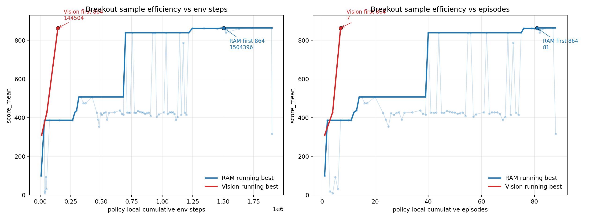
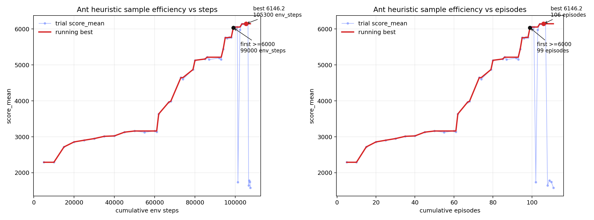
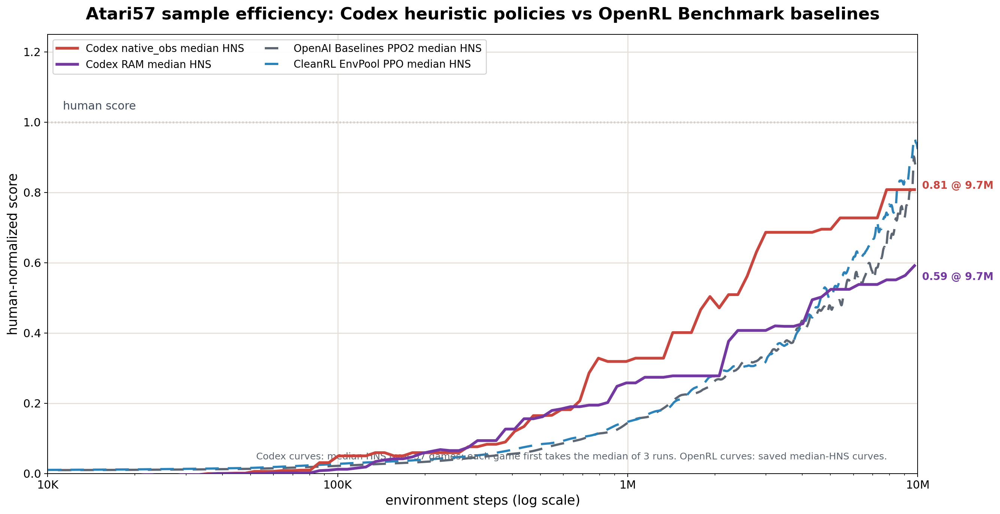
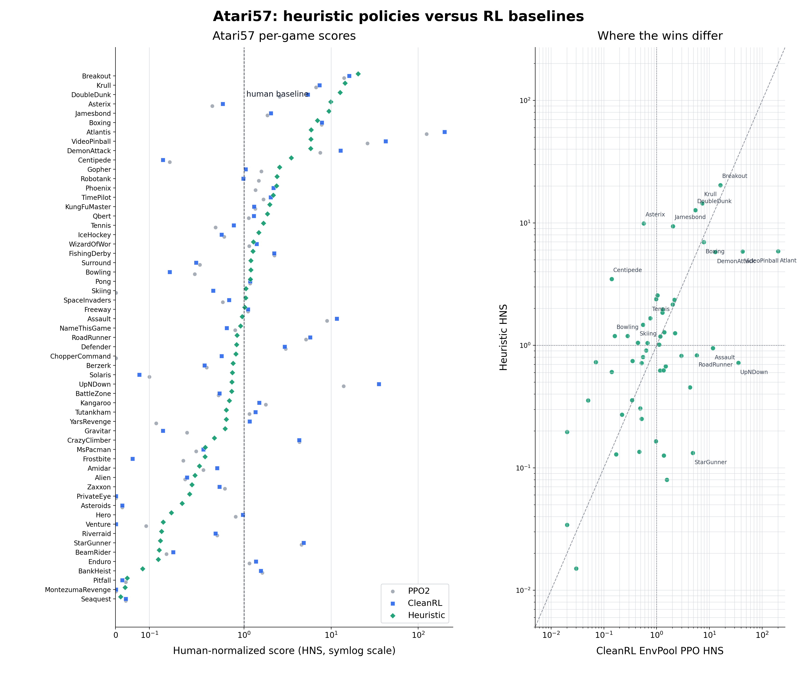

# Heuristic Systems：软件开始自我进化

> Jiayi Weng

## 摘要

这篇文章想讨论一个小问题，但我觉得它会越来越大：当 coding agent 会写代码、跑实验、看失败、改策略、留下记录时，过去那些因为太难维护而被嫌弃的启发式系统，会不会重新变成一种重要的软件形态？

说得有野心一点：coding agent 正在让软件系统有了代谢。测试失败、日志异常、用户反馈和实验结果，不再只供人复盘，也能被消化成代码、配置、测试和 memory 的改动。代码和配置开始承担一部分“参数”的角色；测试、日志、监控和用户反馈开始提供更新方向。很多过去只能靠人慢慢修的系统，现在有机会进入持续自我更新的状态。

我把这类系统称为 **heuristic system**。它的核心是一套会把反馈写回自身的软件闭环：失败会变成回归测试，高分会变成策略版本，异常日志会变成新的状态检测器，人工经验会变成可执行的更新。重点不在“规则突然比神经网络聪明”，而在维护规则的人力成本变了。一个有耐心的 coding agent 能接过那些原来很烦的工作：探测输入语义、写状态检测器、调参数、看失败视频、删掉无效分支、把成功经验固化成测试。

我用 EnvPool 里的 Atari 和 MuJoCo 做了一组小实验。约束很简单：不训练神经网络，不做强化学习式的 policy / value 更新，策略必须是可执行代码，所有实验要留下日志、曲线、视频或复现命令。在这套设置下，Codex 5.4 `xhigh` 把 Pong 推到 `21`，Breakout 推到 `864`，Ant-v5 推到单局最高 `6146`、5 局均值 `6005`，HalfCheetah-v5 推到单局最高 `12041`、5 局均值 `11837`。在一次无人值守的 Atari57 批量实验里，它还把中位数 human-normalized score 推到接近 OpenRL Benchmark 里 PPO 基线的区间。

这篇文章不打算讲“启发式打败强化学习”。准确一点说，当输入相对规整、反馈便宜、失败能回放时，coding agent 能维护一种由观测、状态表示、程序策略、动作、反馈、记忆和更新组成的闭环。用 RL 的语言看，policy、action、reward、memory、update 被放回更大的软件系统里：更新对象包括表格或参数，也包括代码、测试、状态表示和 memory。以前这层东西常常因为没人长期照料而烂掉；现在它有了一个很能熬夜的维护者。

**关键词：** coding agent，heuristic system，反馈闭环，EnvPool，Atari，MuJoCo，程序化策略，样本效率

## 1. 引言

这件事一开始很普通。

我当时在给 EnvPool 做环境正确性验证，需要一些比随机策略强很多、但又不需要训练的策略。随机策略太弱，很多环境一整局都碰不到关键奖励；失败时只能看到超时或者 0 分，很难判断是环境错了、封装错了，还是策略根本没走到有信息量的状态。给每个环境都训练一个神经网络又太重，训练脚本、依赖、版本、检查点，都会变成测试系统自己的负担。

于是问题变成了：

```text
能不能写一些便宜、可复现、比随机强很多的 heuristic，
专门把环境跑到有信息量的状态？
```

一开始我直接问 Codex：“写一个能解决 Breakout 的策略。”效果一般。低分没有解释力：它不知道是动作语义错了、状态检测错了、评测设置错了，还是策略结构本身不行。后来我把任务改成了另一种形式：别只交一个 `policy.py`，要维护完整闭环。

闭环大概长这样：

```text
探测动作和观测
-> 写状态检测器
-> 写策略
-> 跑完整回合
-> 记录 trials.jsonl 和 summary.csv
-> 生成视频或曲线
-> 看失败模式
-> 改策略
-> 简化代码并做回归
```

最后产出的是一套还能继续改的实验系统，不只是一个策略文件。变化很小，但它抓住了整件事的要害。

本文的中心论点是：

```text
coding agent 让启发式规则的维护成本下降了；
一旦维护成本下降，很多过去不值得维护的 heuristic，
会重新变成可用、可测、能持续更新的软件系统。
```

后面我先给出一个定义和几个推论，再讲实验设置和结果，最后讨论这件事和代码仓库维护、Codex memory、机器人系统之间的关系。

## 2. Heuristic System：定义和动机

### 2.1 定义：什么是 Heuristic System

heuristic system 是把经验规则放进一个会更新的软件闭环。

以 Breakout 为例，“球在左边就把挡板往左移”是一条 heuristic。真正让它变成系统的，是后面那套配套机制：怎样检测球和挡板，怎样确认动作含义，怎样发现球路卡住了，怎样复现某个 387 分或 864 分，怎样记录一次改动为什么有效，下一轮又该从哪里继续。

分界不在规则数量，而在反馈能不能进入下一轮运行。系统如果只执行固定规则，它只是 heuristic program；系统如果会根据历史结果改写之后的状态表示、行动逻辑、评估方式或记忆，它才是本文讨论的 heuristic system。

本文把 HS 写成七个部分：

```text
HS = (O, Z, P, A, R, M, U)
```

`O` 是 observation，指系统看到的东西。它可能是图像、RAM、状态向量、日志、请求特征、代码 diff、监控指标，也可能是用户反馈。

`Z` 是内部状态表示。原始输入通常不能直接拿来决策，需要先整理成一组可用变量：球和挡板的位置、机器人姿态、服务负载、PR 风险区域、请求类型、失败模式。它可以是普通变量，也可以是 belief、特征、缓存或风险标签。

`P` 是 policy / program，也就是行动逻辑。它可以是条件分支、阈值、状态机、宏动作、控制器、路由策略、回退策略、测试选择策略。

`A` 是 action，指真正落到外部世界里的动作或输出。比如 Atari 按键、机器人关节力矩、一次路由切换、一组被选择的测试、一个代码 patch、一条回复，或者一次 memory 写入。

`R` 是 reward / feedback。它回答“这次行动或改动好不好”：回报、测试结果、延迟、错误率、成本、人工标注、线上指标、回放评分。它不一定是单个标量，但要能给更新提供方向。

`M` 是 memory。它保存每一次尝试：策略版本、配置、实验结果、失败原因、回放材料、回滚点。没有这层记忆，agent 跑二十轮以后很容易原地打转。

`U` 是 update。它根据 `R` 和 `M` 修改 `Z`、`P`，有时也修改 `A` 的接口、`R` 的评估方式和 `M` 的组织方式。改动要留下来，写进代码、配置、测试、memory 或策略版本里，影响下一轮运行。coding agent 的位置就在这里：它写策略，也让策略系统持续更新。

这不保证系统每轮都会变强。更新过程还需要回归或选择机制，把明显变差的改动筛掉。没有筛选，系统只是漂移。

所以 heuristic system 大概长这样：

```text
O -> Z -> P -> A -> R -> M -> U
```

如果 `U` 只发生在人脑里，或者改动不能影响下一轮运行，那它更像 heuristic program。加上记忆、反馈和持久更新，才是本文说的 heuristic system。

### 2.2 性质和推论

这条定义最有想象力的地方在于，它把很多软件系统重新归到“可学习系统”的范围里。

```text
只要一个系统能被观测、能行动、能被评价、能留下历史，
并且 coding agent 能改写它，
它就可以被看成一个 heuristic system。
```

这会把范围拉得很大。HS 的范围不止游戏和机器人。代码仓库、CI 系统、线上服务、灰度发布流程、incident runbook、数据 pipeline、实验平台、推荐系统、个人工作流、团队协作流程，都有机会被写成 HS。它们原来就有输入、规则、动作、反馈和历史；缺的往往是一个能持续把反馈写回系统的人。

coding agent 补上的正是最后那一步：

```text
代码和配置 ~= 参数
测试、日志、监控、用户反馈 ~= reward
git history、实验记录、memory ~= replay buffer
PR、patch、配置变更 ~= 代谢
```

这样看，很多软件系统突然变得“可训练”。训练方式不一定是梯度下降，也可能是代码更新。一个 runbook 不能 backprop，但它能在事故复盘后被 agent 改写；一个 CI 系统没有神经网络参数，但它能根据误报、漏报和失败历史调整测试选择；一个机器人控制栈不一定端到端训练，也能让关节级、肢体级、任务级的小闭环分别积累经验。

这也是 HS 和普通自动化的差别。普通自动化把流程写死：来了输入，就按流程走。HS 会把失败、成功、回放和历史记录变成下一轮流程的一部分。只要 `U` 能落地，系统就有了自己的学习通道。

边界也很重要。人脑本身不是本文讨论的 HS。原因很简单：coding agent 不能直接插进人脑，读写神经连接，再把改动持久化到下一轮认知里。人的外部工作流倒是可以变成 HS：笔记、日历、代码、memory、脚本、复盘文档、团队流程都能被 agent 读取和改写。但人脑本体不在这个定义里。

所以这篇文章真正想讲的是：

```text
很多非可微、非神经网络、原本只能靠人维护的软件系统，
现在第一次有了便宜的代谢能力。
```

如果这条路继续往前走，很多强系统未必长成“一个大模型包办所有事情”。更可能的形态是一组层级化的 HS：模型负责感知、泛化和长程价值，HS 负责把反馈写回代码、测试、规则、memory 和工具链。每一层都能积累经验，上一层还能改下一层的接口和评估方式。真正的复利来自这里。

### 2.3 为什么以前这条路走不远

人当然会写 heuristic。一条规则甚至能写得很漂亮：

```text
球在左边就往左移动。
机器人快摔倒了就先稳住身体。
PR 改了鉴权路径就多跑测试。
延迟高就切一部分流量。
```

问题是系统不会停在这一层。很快它会变成：

```text
球在左边，但速度很快，而且动作有一帧延迟，直接追会过冲。
机器人快摔倒了，但当前接触点不可信，恢复动作不能太激进。
PR 改了鉴权路径，但只是重命名；真正危险的是共享工具函数语义变了。
延迟高，但备用路径错误率也高，只能切一小部分，还要防止重试风暴。
```

复杂性来自规则之间的相互作用、反馈滞后、例外处理、回归测试和历史包袱。过去 heuristic 走不远，常常卡在维护成本上，而非规则本身。

coding agent 改变的是维护动作本身。它不一定每次都能想出最聪明的规则，但能持续做这些很磨人的事情：

- 从失败日志里找模式。
- 写探针确认输入语义。
- 跑一批候选规则。
- 记录每个候选的配置和结果。
- 看视频或 replay 定位失败点。
- 修改规则，同时不破坏旧 case。
- 删除已经没用的分支。
- 把规则迁移到新的输入格式。
- 在指标变差时回滚。
- 把经验固化成测试。

小规模 heuristic 不需要 agent。长期更新、带实验记录和回归测试的 heuristic system，在 coding agent 出现后才真正现实。

## 3. 实验

### 3.1 实验设置

所有实验都在 EnvPool 里跑。约束故意设得很窄：

- 不训练神经网络。
- 不做强化学习式的 policy / value 更新。
- 策略必须是可执行代码。
- 每次实验记录环境步、分数、配置和备注。
- 最终留下可复现命令、曲线、视频或策略脚本。

模型配置主要是 Codex 5.4、`xhigh`。我没有系统比较不同模型大小、推理强度和提示词，所以本文偏现象报告，不是完整 benchmark。

单点实验里，我会看中间结果，再让 Codex 沿某个方向继续迭代。Atari57 批量实验不同：我用 Codex CLI 一次性启动很多 `gpt-5.4 xhigh` agent，每个 agent 拿到同一个模板和不同的 `ENV_ID / OBS_MODE / REPEAT_INDEX`，随后全程不干预，等它们自己停下再收结果。为了减少不可见上下文，我没有用 Codex App，也没有让它读长期记忆。

代表性结果如下：

| 任务 | 设置 | 结果 | 说明 |
|---|---:|---:|---|
| Pong-v5 | Atari | `21` | 达到最高分。 |
| Breakout-v5 | RAM | `864 / 864 / 864` | 三局验证都到理论最高分。 |
| Breakout-v5 | RGB 图像 | `864` | 先在 RAM 找到几何控制，再迁移成纯图像检测。 |
| Ant-v5 | MuJoCo state | max `6146.2`，5 局均值 `6005.5` | 从节律步态演化到残差模型预测规划。 |
| HalfCheetah-v5 | MuJoCo state | max `12041.2`，5 局均值 `11836.7` | 用可解释步态/姿态规则和在线 staged-tree MPC 推高回报；复测 seeds `100..104`。 |
| Atari57 | RAM + native image | `342` 条无人值守搜索轨迹 | `57` 个游戏，每个输入模式 `3` 次独立运行。 |

下面几组 case study 分别看几类信号：单个离散控制任务能不能被推到满分；连续控制里能不能长出复杂反射；批量无人值守时分布长什么样；遇到不适合反应式规则的任务时，边界在哪里。

### 3.2 Case Study A：Breakout

Breakout 表面上是几何问题：球在哪里，挡板在哪里，球撞墙以后会落到哪里。真正麻烦的是后半段：策略能一直接到球，却打不到新砖，分数卡在一个稳定循环里。

Codex 第一轮没有急着写最终策略。它先确认动作空间和观测形状，再从 RGB 画面里找挡板、球、砖块颜色，然后用这些图像标签去扫 128 个 RAM 字节。早期实验记录大概长这样：

```text
trial_name                 score   cumulative_env_steps   note
shape_action_probe          -      32                     inspect obs/info/action
ram_byte_corr_probe_v1      -      5,032                  correlate RAM bytes
ram_fit_action_probe_v2     -      9,532                  action 2=right, 3=left
baseline_v0                99      16,303                 initial RAM intercept
tunnel0_v1                387      43,303                 no tunnel offset
```

`387` 是第一个很容易骗过人的局部高分。策略已经能稳定接球，但它只是把球送进一个周期：不会死，也不会继续清砖。如果是人手写，很容易继续调“接球精度”。Codex 看了视频和最后几十步轨迹后发现，真正的问题是球路缺少扰动。

<video controls src="heuristic_breakout_score387_tunnel0_render210x160.mp4" width="360"></video>

第一个关键机制是打破循环：如果连续很久没有奖励，就在预测落点上周期性加偏移，把球从局部循环里打出去。这一改把分数从 `387` 推到 `507`。

```python
if steps_since_reward >= stuck_trigger_steps:
    phase = stuck_offset_index % 4
    if phase == 0:
        offset = +stuck_offset_px
    elif phase == 1:
        offset = -stuck_offset_px
    elif phase == 2:
        offset = +0.5 * stuck_offset_px
    else:
        offset = -0.5 * stuck_offset_px
else:
    offset = 0.0
```

后来又遇到另一个失败模式：高速低位球如果按普通截距追，挡板会被过度前视带偏。Codex 加了 `fast_low_ball_lead_steps=3`，分数从 `507` 跳到 `839`。

```python
if vy > 0.1 and ball_y <= paddle_y:
    steps_to_paddle = max((paddle_y - ball_y) / vy, 0.0)
    intercept_x = reflect_position(ball_x + vx * steps_to_paddle)
    target_x = intercept_x + stuck_offset
elif vy >= fast_ball_min_vy:
    target_x = ball_x + fast_low_ball_lead_steps * vx
else:
    target_x = ball_x + chase_lead_steps * vx
```

从 `839` 到 `864`，最像在照料一个复杂 heuristic system。Codex 试了死区、发球偏移、卡住偏移、砖块平衡偏置、前视步数，很多方向都没用。最后起作用的是一个后期条件：分数超过第一面墙以后，卡住偏移只在离挡板还远的时候生效；快接球时把偏移逐步收掉，不然最后几块砖阶段会自己把挡板带偏。同时它加了一个很小的挡板漂移补偿，用来补动作和挡板位置之间的一步延迟。

```python
if score >= 432 and stuck_release_horizon_steps > 0:
    release_ratio = clip(steps_to_paddle / stuck_release_horizon_steps, 0.0, 1.0)
    offset *= release_ratio

if score >= 432 and ball_y >= 170 and last_action == RIGHT:
    control_paddle_x = paddle_x + 2.0
elif score >= 432 and ball_y >= 170 and last_action == LEFT:
    control_paddle_x = paddle_x - 2.0
```

<video controls src="heuristic_breakout_ci3985ae2_score864_render210x160.mp4" width="360"></video>

最终 RAM 默认配置三局验证是 `864 / 864 / 864`。后面 Codex 又把同一套几何控制迁移回纯图像输入：不用 RAM，只用 RGB 分割找挡板、球和砖块平衡。纯图像版本先是 `310`，然后 `428`，最后把后期“卡住偏移逐步收掉”的阈值放低到全程生效，7 个策略本地回合后第一次到 `864`，对应图里的 `14,504` 个策略本地环境步。



这段不能写成“纯图像从零 14.5K 步到满分”。实际过程是：Codex 先在 RAM 版本里摸出了几何控制、打破循环、后期收偏移这些结构；等结构稳定以后，再把状态读取层从 RAM 换成 RGB 检测器。纯图像的 `14.5K` 是迁移预算。

这件事给出的信号不止分数。启发式策略一旦被写成可维护的软件结构，就能替换输入层、重用控制逻辑、继续回归测试，不必每换一种观测就重新训练。

完整策略代码在 [`heuristic_breakout.py`](heuristic_breakout.py)，实验记录在 [`heuristic_breakout_trials_summary.csv`](heuristic_breakout_trials_summary.csv)。

### 3.3 Case Study B：Ant 和 HalfCheetah

Ant 对我更意外。Breakout 的几何结构还比较直观；Ant 是连续控制，动作是 8 个关节，失败模式也不再只是“球没接到”。

我没有一开始就指定“用 CPG”或“用 MPC”。要求只有几条：别训练神经网络，能本地复现，每轮实验留下记录，继续把分数往上推。Codex 先读 EnvPool/Gymnasium 的 Ant 观测和回报，确认动作顺序、根部速度、躯干朝向、关节位置和关节速度，然后自己提出第一版节律步态。

第一版是四腿相位振荡器：左右腿反相，髋关节和踝关节跟踪正弦目标角，动作由 PD 控制器给出。它不优雅，但一上来就比随机强很多，5 个随机种子的平均分是 `2291`。

```python
leg_phase = warp_phase(phase + LEG_PHASE, stance_duty(vx))
stance = leg_phase < pi

hip_wave = HIP_BIAS + stance_or_swing_scale * (
    HIP_AMP * sin(leg_phase)
    + HIP_H2_AMP * sin(2 * leg_phase + HIP_H2_PHASE)
    + HIP_H3_AMP * sin(3 * leg_phase + HIP_H3_PHASE)
)

action[0::2] = KP * (
    HIP_SIGN * hip_wave
    + HEADING_AXIS * (YAW_GAIN * yaw + YAW_RATE_GAIN * yaw_rate)
    - q[0::2]
)
action[1::2] = KP * (ANKLE_SIGN * (ankle_wave + balance) - q[1::2])
```

后面的早期迭代很像调一个真实控制器：先加偏航反馈到 `2718`，再调相位速度、髋/踝幅度、偏航角速度增益到 `3025`，然后加二阶/三阶谐波到 `3162`。Codex 也试过大范围参数搜索，但结果没有稳定超过当前节律策略，于是停止扩大搜索预算，转向另一种表示。

跃迁来自残差模型预测规划，也就是代码里写的 MPC。粗略讲，MPC 是“边走边想一小段未来”：保留节律步态作为基础反射，每个真实环境步在本地 MuJoCo 模型里采样几十条小的残差动作序列，打分后只执行第一个残差动作；下一步重新看状态、重新规划，并把上一轮没执行完的计划作为热启动。

这样每一步都不用从零规划 8 个关节怎么动。策略先有一个稳定步态，再用短视窗模型规划去修正它。

```python
base = cpg_action(phase, q, dq, roll, pitch, yaw, rates, contacts, vx)

best_plan = previous_plan.copy()
best_obj = rollout_objective(obs, best_plan)
for _ in range(CANDIDATES - 1):
    residuals = clip(
        best_plan + rng.normal(0.0, MPC_SIGMA, size=(HORIZON, 8)),
        -MPC_CLIP,
        MPC_CLIP,
    )
    residuals[1:] = 0.6 * residuals[1:] + 0.4 * residuals[:-1]
    obj = rollout_objective(obs, residuals)
    if obj > best_obj:
        best_obj = obj
        best_plan = residuals

plan[:-1] = PLAN_DECAY * best_plan[1:]
return clip(base + best_plan[0], -1.0, 1.0)
```

这些结构并非我作为强先验塞进去的。节律策略到 `3162` 后，Codex 自己写了一个基于模型的残差规划器。第一版视窗长度 6、32 个候选、小残差，就从 `3135` 提到 `3635`。接着它继续扩展这套控制器：

```text
trial_name                               score_mean   cumulative_env_steps   note
ant_lr_cpgpd_v1                         2291.9       5,000                  左右腿反相 CPG + PD
ant_yawaxis_grid_v2                     2857.9       20,000                 偏航反馈 + 重调参数
ant_h3_428_v1                           3162.0       50,000                 二阶/三阶谐波
ant_mpc_residual_v1_ep1                 3635.5       62,000                 视窗=6，候选=32
ant_mpc_residual_cfg4_eval5             3964.7       67,000                 视窗=8，候选=48
ant_mpc_residual_cand07_eval5           4647.1       73,000                 围绕 MPC 配置做局部搜索
ant_mpc_residual_narrow04_eval5         4871.3       79,000                 降低 z 目标，增大 kp/候选数
ant_mpc_residual_warm02_eval5           5165.2       85,000                 热启动残差计划
ant_mpc_fast065x060_sigma008_clip012    5759.4       95,000                 更快步态 + 更大残差
ant_mpc_term001_ep1                     6054.5       100,000                终端速度代价
ant_mpc_default_adaptive_ep1            6146.2       106,300                速度自适应相位 + 支撑期
```



<video controls src="heuristic_ant_mpc_default_6146_render480.mp4" width="480"></video>

完整实验脚本在 [`heuristic_ant.py`](heuristic_ant.py)，抽出的最小可调用策略在 [`heuristic_ant_min_policy.py`](heuristic_ant_min_policy.py)，实验记录在 [`heuristic_ant_trials_summary.csv`](heuristic_ant_trials_summary.csv)。

Ant 的信号和 Breakout 不一样。Breakout 是发现几何以后，输入规整化带来了很夸张的样本效率；Ant 说明另一件事：启发式系统能一路长复杂，同时仍然保持可检查、可复现、可继续修改。到最后，策略里有振荡器相位、支撑期比例、速度自适应、滚转/俯仰/偏航反馈、脚部接触、短视窗模型内展开、残差平滑、终端速度代价、热启动计划衰减。人类当然能写其中一两个模块，但要在短时间内照顾好实验记录、代码、视频和失败方向，难度完全不同。

HalfCheetah 是同一类证据的另一个点。我重新跑了 `mpc-staged-tree-asym-pd-cpg` 的 5 局复测，seeds `100..104` 的结果是均值 `11836.7`、最小值 `11735.0`、最大值 `12041.2`。策略靠的是可解释的步态/姿态规则和在线 staged-tree MPC：先用 CPG/PD 形成高分步态，再用短视窗模型评分和 staged swing-amplitude schedule 修正动作。对应脚本是 [`heuristic_halfcheetah_v5.py`](heuristic_halfcheetah_v5.py)，迭代记录在 [`heuristic_halfcheetah_v5_log.md`](heuristic_halfcheetah_v5_log.md)。

### 3.4 Case Study C：Atari57 批量运行

Breakout 和 Ant 都是单点故事。Atari57 则是规模化检验：同一套 Codex 工作流直接扔到整套 Atari57 上，每个环境同时跑 `ram` 和 `native_obs` 两种输入，每种输入跑 3 个独立重复。总共是：

```text
57 个游戏 x 2 种输入 x 3 次运行 = 342 条 coding-agent 搜索轨迹
```

这组实验没有人在旁边一点点提示。我用 Codex CLI 批量启动 `gpt-5.4 xhigh`，每个 agent 拿到同一个模板和不同的 `ENV_ID / OBS_MODE / REPEAT_INDEX`，然后自己执行到停止。每个 run 都要写 `policy.py`、`trials.jsonl`、`summary.csv`、`sample_efficiency.png` 和 `README.md`。

完整提示词放在 [`atari57_prompt_template.txt`](atari57_prompt_template.txt)。主要约束是：

```text
目标：只针对一个 EnvPool Atari 环境，在给定 OBS_MODE 下自己设计并迭代手写 heuristic policy。

硬约束：
- 不训练神经网络。
- 不读环境源码、测试、ROM 细节或隐藏状态。
- native_obs 模式只能用 reset/step 返回的原生 obs。
- ram 模式可以用 info["ram"]。
- Atari 初始化参数固定，包括 frame_skip=1、reward_clip=False、sticky action=0。
- 所有实际 step 过环境的 probe/debug/trial 都必须计入 cumulative_env_steps。

输出文件：
- policy.py：当前最好且尽量简化的 heuristic。
- trials.jsonl：每次 trial 的分数、环境步、配置、备注。
- summary.csv：从 trials 汇总。
- sample_efficiency.png：按环境步和 episode 画分数曲线。
- README.md：最好分数、复现命令、失败方向、停止原因。
```

这张图里的横轴从 `10^4` 环境步开始，因为前面的部分基本看不出变化；纵轴是 Atari human-normalized score，也就是 HNS。Codex 曲线按 Atari 常见的中位数口径画：每个游戏先把 3 次独立运行取中位数，再在 57 个游戏上取中位数。这种口径不会被少数特别高分的游戏拉爆，主要看覆盖率。



在完全无人工介入的批量运行里，`native_obs` 到 `9.7M` 步附近是 `0.81`，`ram` 是 `0.59`。同一张图里，[OpenRL Benchmark](https://arxiv.org/abs/2402.03046) 保存的 PPO2 / CleanRL EnvPool PPO median HNS 曲线到 `10M` 步大约是 `0.88 / 0.92`。

这不能写成 heuristic 已经全面超过强化学习。谨慎一点说，一个还很粗糙的 coding-agent 批量流程，在完全不看中途结果的情况下，已经能把 Atari57 的中位数推进到接近这些基线的区间。

聚合曲线会把差异压到一个中位数里，所以我又把 57 个游戏逐个摊开画了一张。Atari 原始回报跨游戏没有可比性，这里仍然用每个游戏自己的 HNS；虚线 `1.0` 表示人类分数。



这张图能看出两件事。第一，重合是有的：Breakout、Krull、DoubleDunk、Boxing、DemonAttack 这些游戏里，heuristic 和强化学习基线都能拿到明显高于人类基线的分数。第二，差异也很大：heuristic 在 Asterix、Jamesbond、Centipede、Bowling、Skiing、Tennis 这类游戏上相对突出；PPO 在 Atlantis、VideoPinball、UpNDown、Assault、RoadRunner、StarGunner 上明显强很多。

这张分布图比一个中位数有信息。heuristic system 并没有均匀地学会“玩 Atari”。它在某些游戏里很快写出了有效机制，在另一些游戏里还没有找到合适的状态表示或长期策略。

比较口径也要讲清楚。Codex 曲线来自 342 条批量运行的原始 `summary.csv`，我按 `cumulative_env_steps` 还原每条搜索轨迹。它不能当严格排行榜：Codex 写代码、读日志和看视频的计算量没有按神经网络训练计算量计入；PPO 曲线则来自基准数据保存的中位数 HNS 曲线。这段比较主要看一个信号：在规整输入下，coding agent 维护的启发式策略只用很少环境交互，就能把不少游戏推到有竞争力的区间，而且 RAM 和原生观测没有差得离谱。

我觉得 Atari57 最有意思的地方，是样本效率的来源变了。传统神经网络 Atari 学习要在每个环境里从高维输入重新学表示、信用分配和动作含义；Codex 做的则是把环境拆成可维护的小程序系统：射击游戏的瞄准/躲避，接球游戏的反弹，躲避游戏的位置规则，环境包装器细节，以及每个环境自己的失败实验记录。它没有训练出一个通用神经网络，而是在批量生成、验证和修改一批局部启发式策略。

### 3.5 反例也重要：Montezuma

有些环境不适合普通反应式启发式策略。Montezuma's Revenge 是典型例子。

之前那轮单独搜 Montezuma 的状态图搜索能把钥匙距离从 `72` 推到 `28`，但奖励仍然是 `0`。后面 Atari57 的纯图像批量实验里，有一条无人值守 Codex run 到了 `400.0` 分：修复后的最佳 replay 是 `repair_replay_r1_t19734`，seed 是 `10001`，用了 `1769` 个环境步，本质是一条 `86` 个宏动作组成的开环路线。

我把恢复出来的 [policy](heuristic_montezuma_400_policy.py)、[宏动作](heuristic_montezuma_400_macros.json) 和 [视频](montezuma_400_render_seed10001.mp4) 放在了 repo 里。

<video controls src="montezuma_400_render_seed10001.mp4" width="360"></video>

Montezuma 暴露的问题不在于“heuristic 完全不行”。普通 `policy.py` 状态机表达力不够：动作必须对齐时机，失败后要能恢复，中间状态还要能重新进入计划。有些环境需要可组合宏动作、可恢复搜索状态，甚至需要一种比普通 `if else` 更适合长期规划的程序结构。

这类失败对 heuristic system 很有价值。它告诉我们边界在哪里，也提示下一层抽象大概该长什么样。

### 3.6 这组实验支持什么

这组实验支撑的结论应该收得比较窄：

```text
当输入相对规整、反馈成本低、失败能回放时，
coding agent 能维护一个由状态表示、程序化策略、动作、反馈、记忆和持久更新组成的系统，
并用很少真实环境交互找到有竞争力的策略。
```

这里面有四个点。

第一，样本效率不止来自规则“写得好”。它来自一整套被写进程序里的结构：几何、局部控制、动作语义、可视化调试、失败回放、参数扫描。过去这些结构要靠人照料，所以很贵；现在 coding agent 能把一次实验的结果变成下一轮代码改动。

第二，可解释性很关键。Breakout 的每个提升都能落到具体机制上：球路卡住、低位高速球、后期偏移收敛、挡板动作延迟。Ant 的每个提升也能落到具体模块上：相位、偏航反馈、谐波、残差规划、热启动。失败时能直接打开代码和视频，看是哪条条件、哪个状态估计、哪个动作延迟出了问题。

第三，人工介入现在仍然有用，但不是唯一入口。Breakout 和 Ant 里，我会看结果、追问、让 Codex 沿某个方向继续；这能把单点分数推高。Atari57 则显示，即使完全不看中间结果，批量启动的 agent 也已经能找到不少有效策略。未来模型能力继续上升时，很多“看失败视频、判断缺哪个机制、继续改代码”的步骤会越来越便宜，甚至直接进入无人值守流程。

第四，测试和约束不能事后再补。Breakout 里的 `864` 复现、Ant 里的 5 局均值、Atari57 里的步数预算、不能读环境源码、`native_obs` 不能读 RAM，这些都在给 agent 画边界。边界越清楚，更新过程越容易被搜索、重构和替换；边界越模糊，agent 越容易优化出一个偶然能跑、但不可维护的脚本。

所以这条路不是简单回到手写规则时代。变化在于，规则系统第一次有了一个便宜又有耐心的维护者，能把反馈连续写回系统本身。

## 4. Discussion：不只是在游戏里

这个概念不应该只放在游戏或机器人里。很多工程系统本来就有反馈闭环的影子，只是我们平时不这么叫。

### 4.1 代码仓库维护

有经验的工程师做代码审查时，会用很多启发式判断：

```text
这个 diff 改了鉴权路径，风险高。
这个测试失败像不稳定测试，先查主干最近是否也失败。
这个函数被多个服务复用，不能轻易改返回语义。
这个改动碰到启动路径，可能影响导入时间。
这个 PR 太大，应该先拆出机械改动。
```

这些判断没有形式化证明，也不是端到端模型训练出来的。它们是工程经验。但它们也不纯主观，因为 CI、线上事故、历史提交、代码审查评论和测试覆盖会不断校正它们。

如果写成 `(O, Z, P, A, R, M, U)`：

```text
O = diff、CI 日志、代码索引、历史事故、监控指标
Z = 风险区域、依赖图、owner、失败模式、测试覆盖
P = review 规则、测试选择、拆 PR 策略、回滚策略
A = review 评论、测试运行、代码 patch、PR 拆分、回滚动作
R = CI 结果、线上指标、代码审查反馈、缺陷回归率
M = PR 历史、失败记录、决策理由、修复路径
U = coding agent 修改检查脚本、测试策略、文档和代码
```

这时 coding agent 做的远不止“帮我写代码”。它在维护一个代码仓库的启发式控制系统：哪些路径危险，哪些测试有信息量，哪些失败像历史问题，哪些规则已经过时，都能被记录、执行和修改。

软件工程已经给这种系统准备了很成熟的材料。单元测试、集成测试、黄金用例、回归测试、lint、类型检查、CI、性能基线，它们不只是质量检查，也是在给代码库建立协议。协议说清楚一个函数对外承诺什么，旧缺陷不能怎样复发，某个库的边界在哪里，哪些路径改动以后必须多跑测试。

一旦协议够完整，内部实现就能大胆替换。比如一个解析器只要继续通过语法黄金用例和错误恢复测试，它内部是手写递归下降、解析器生成器，还是一套被 agent 重构过的状态机，都没那么要紧。真正要紧的是边界有没有覆盖住下游依赖的行为。

测试、lint、CI 本身还不够。它们开始像本文说的 HS，是在 coding agent 会根据失败记录和历史经验改测试、改检查脚本、改风险标签、改拆 PR 策略以后。agent 最擅长在明确反馈下改代码；测试越像可执行协议，agent 就越能在边界内部搜索实现。反过来，如果测试写得很差，agent 只会更快地利用漏洞，把系统推向错误的局部最优。坏测试就是坏奖励信号，只是穿了软件工程的衣服。

### 4.2 Codex memory

Codex memory 是一个更贴近 agent 自身的例子。

如果 memory 只是静态存储，那它更像 `M`：历史任务、用户偏好、项目习惯、踩过的坑，都放在一个地方，等之后检索。单独看这层，它还不是 heuristic system。

但实际使用里，memory 往往会被加工。模型会读取它，判断哪些内容和当前任务有关，把一段历史压缩成摘要，合并重复经验，丢掉噪音，再用检索到的内容影响下一次行动。到这一步，memory + model 就开始形成一个小型 heuristic system：

```text
O = 当前任务、历史对话、代码上下文
Z = 被检索出来的 memory、压缩后的用户偏好、项目习惯
P = 由 memory 影响的行为倾向，例如怎么写代码、怎么回复、避开什么坑
A = 实际回复、代码改动、工具调用、memory 写入
R = GPT 对 memory 是否相关、是否矛盾、是否值得保留的判断，也包括任务结果给出的反馈
M = 原始历史、memory 条目、摘要
U = 总结、压缩、合并、删除、改写 memory 的过程
```

这里最有意思的是 `R` 和 `U`。GPT 本身就能充当评价信号的一部分：它会判断某条 memory 是否适用于当前任务，是否和新信息冲突，是否应该被改写成更短、更泛化的经验。memory 总结并非单纯“整理笔记”，它已经是对 `M` 的更新；如果摘要又改变下一次的 `Z` 或 `P`，闭环就转起来了。

所以 memory 本身更像经验材料。当模型会读取它、评价它、压缩它、改写它，并让它影响之后的行为时，memory + model 才组成一个 heuristic system。

这也解释了为什么 agent 的长期记忆和普通日志不一样。普通日志只是留下痕迹；会被模型重新解释和改写的 memory，会改变之后的状态表示和默认行为。它不一定总是变好，但闭环已经出现了。

### 4.3 机器人：hierarchical HS

Ant 让人很自然想到机器人，但这里最容易讲过头。

仿真里能让 Codex 几万步、几百万步试错，摔了也只是重置；真实世界里每次试错都有时间、硬件磨损、安全、场地复位和传感器漂移成本。所以这套闭环不能直接搬到真机上，更不能像在仿真里那样盲跑。

我更愿意把它看成一种 **hierarchical HS**，也就是一组层级化的小闭环。低层负责局部安全和低延迟控制，中层负责肢体协调和接触，高层负责任务、恢复和长期记忆。

```text
关节级 HS -> 肢体级 HS -> 全身平衡 HS -> 任务级 HS
```

关节级 HS 看到编码器、力矩、电流、IMU 和接触传感器，把它们整理成误差、速度、负载、危险标志，然后输出目标位置、目标速度或力矩命令。它的反馈是过载、打滑、能耗、安全违规；更新过程主要改增益、阈值、保护规则和测试。这里的更新必须很保守，不能让 agent 在真机上随便改安全边界。

肢体级和全身级 HS 可以负责步态、接触策略、摔倒恢复、身体姿态和能耗。任务级 HS 再往上，负责“先靠近杯子，再调整夹爪，再失败恢复”这种长一点的流程。这样看，机器人不是由很多“HS 关节”组成，而是由很多局部 HS 通过层级关系串起来。

操作任务会麻烦很多。叠衣服、整理线缆、打开软包装这种任务，难点并不限于“机器人关节怎么动”，还在物体本身的状态：布料形变、遮挡、接触历史、摩擦、皱褶、目标形状。光靠调几个关节相位解决不了这类问题；如果没有好的感知表示、可恢复的动作原语和足够真实的仿真，coding agent 也会在错误的状态变量上写出很脆的规则。

现实一点的形态可能是混合系统：仿真和离线数据先用来生成、筛掉候选启发式；真机上只做小步、安全、有护栏的验证；神经网络负责感知、物体状态估计和长程价值；hierarchical HS 负责低延迟反射、安全约束、局部恢复、任务分解和测试判据；coding agent 负责维护接口、检测、失败处理和回归测试。

这样讲，重点不在“用启发式手写叠衣服”，而在把一些能写成程序的局部规律从端到端训练里拆出来。

### 4.4 和已有范式的关系

heuristic system 和几个已有方向很像，但重点不太一样。

和专家系统相比，HS 更关心反馈闭环。规则既能来自人，也能来自 agent 的搜索；关键是规则会被评估、记录、修改和回归测试，不能只是一次性把专家知识写进去就结束。

和强化学习的关系可以这样看。MDP/POMDP 里，环境有真实状态 `s_t`，agent 看到观测 `o_t`，执行动作 `a_t`，环境转移到下一个状态并给出 reward `r_t`。RL 研究的是怎样从这些轨迹里改进 policy 或 value，让长期 return 变高。

换成本文的七部分，大概是：

```text
O = observation o_t；完全可观测时也可以直接是 s_t
Z = feature、belief state、hidden state、tabular state / index
P = policy pi(a | z)，或者由 V / Q 导出的行动规则
A = action a_t，或者 action space A 里的一个具体动作
R = reward r_t、return、TD error、advantage、value loss
M = trajectory、episode history、transition buffer、replay buffer
U = Bellman backup、TD update、policy iteration、Q-learning、policy gradient、optimizer step
```

所以 RL 可以看成 heuristic system 的一种更严格、更数学化的特例。它把反馈主要收窄成 reward，把记忆收窄成 experience，把更新写成明确学习规则，再用这个更新去改下一轮的 policy、value、表格或参数。1980 年代的表格 TD / Q-learning 算，线性函数近似算，现代 deep RL 也算；神经网络只是其中一种实现。

反过来，把 heuristic system 直接说成 RL 的一种，会把概念压得太窄。HS 的 `A` 可以是代码 patch、测试运行、路由切换、机器人动作或一段回复；`R` 包括测试、CI、视频回放、人工判断、线上指标；`U` 能改代码、状态检测、memory 摘要、评估脚本和回归测试，并不局限于 policy 参数或 value table。它也未必追求一个清楚的 discounted return；很多时候，它追求的是在工程边界内少犯错、容易恢复、能被继续维护。

两者最自然的关系是组合：神经网络负责感知、泛化和长程价值估计；heuristic system 负责局部反射、安全约束、回退策略、测试准则和可解释调试。

和普通流程自动化相比，HS 默认流程本身会被反馈改写，不长期固定。

和 AutoML 相比，HS 的搜索空间不只在模型和超参数里，还包括程序结构：状态怎么表示，规则怎么组织，什么失败要记录，什么测试能防回归，什么分支应该删掉。

### 4.5 限制

第一，结果依赖当前 agent 能力。这里主要讨论 Codex 5.4 `xhigh`。换模型、换推理预算、换工具、换提示词，分布可能会变。本文是现象报告，算不上完整 benchmark。

第二，单点实验有人在环。Breakout 和 Ant 并非全自动基准；我会看结果，决定让 Codex 往哪里继续。Atari57 才是无人值守批量运行。把这两类证据混在一起，会让结论变糊。

第三，能更新不等于自动变好。agent 生成的 heuristic system 可能越写越复杂，最后变成不好维护的代码泥潭。实验记录、回归测试和简化阶段不能省，它们是防止系统塌掉的主要机制。

第四，不要把这条路线讲成强化学习的替代品。上面的对照只是说明两者能放在同一张图里，不代表所有 HS 都该按 RL benchmark 或 return 来评价。神经网络在复杂视觉、跨状态泛化、长程价值估计上仍然有明显优势。合理方向仍然是组合：神经网络负责感知、泛化和长程策略；heuristic system 负责局部反射、安全约束、回退策略、测试准则和可解释调试。

### 4.6 更大的问题

如果 heuristic system 是一个有用概念，它应该导向一些更大的问题。

- 软件系统能不能获得真正的代谢能力？也就是说，它能不能长期把测试、日志、用户反馈、事故复盘和实验结果消化成自身结构的变化，而不是永远等人来维护？
- 当代码、配置、测试和 memory 都可以被 agent 改写时，软件工程会不会变成一种新的学习系统设计？以后写程序，可能不只是写实现，也是在设计这个系统未来如何吸收反馈。
- HS 和神经网络最强的组合形态是什么？一个可能的方向是：神经网络负责感知、泛化和长程价值，HS 负责规则、接口、安全边界、回退策略和可解释的局部控制。
- hierarchical HS 能不能成为机器人、代码库、组织流程和个人工作流的共同抽象？低层负责快速反射和安全，高层负责目标、记忆、复盘和自我修改。
- 如果一个系统可以自我更新，谁来约束它？测试、权限、回滚、可解释记录、人工审核和沙箱，可能会变成 HS 时代的基础设施，而不只是工程配套。
- 人类在这种系统里的位置会怎么变？我们可能不再逐条维护规则，而是设计反馈、边界、评估和目标，让 agent 负责日常代谢。

这些问题比“heuristic 能不能打败强化学习”更大。它们真正问的是：当软件开始能消化反馈、改写自身，软件系统本身会变成什么。

## 5. 结论

这次实验改变了我对启发式策略的看法。以前我会把它归到脆弱、临时拼凑、不可扩展那一类；现在我更愿意把它看成一种能由 coding agent 持续维护的软件系统。它已经不是几条固定规则，而是一组能被测试、可视化、调参、重构、迁移、记录来源的程序化条件反射。

Breakout 显示，单个离散控制任务能被一套可复现的实验闭环推到满分；Ant 显示，即使在连续控制里，Codex 也能从简单节律步态出发，自己引入残差模型预测规划，把一个多关节条件反射系统维护到很高分；Atari57 显示，在规整输入下，由 coding agent 维护的启发式策略能用很少环境步数把中位数 HNS 推到接近神经网络基线的区间，而且这是无人工介入批量运行的结果。

如果继续做下去，我已经不太满足于“再调高某个游戏的分数”。我真正想看的是系统化：给 coding agent 一个环境、一个严格实验记录、一个采样预算、一个渲染/诊断接口，让它自己发现、维护和回归测试一套启发式策略。过去这件事靠人类维护太累，所以几乎没人认真做；有了 coding agent，它突然变成了一个很合理的研究方向。

随着模型能力继续增长，这种迭代时间和成本应该会降得很快。生成一套 heuristic system 会比今天便宜很多。到那时，很多我们以为“不值得手写”的规则层，可能会重新回到软件系统的中心。嗯，有点复古，但不是怀旧，是维护成本曲线真的拐了一下。

## 致谢

感谢 [Costa Huang](https://costa.sh/) 和 [Tairan He](https://tairanhe.com/) 对这条思路和前一版文章的反馈。

## 引用

如果需要在 LaTeX 里引用这篇文章，先用下面这个 BibTeX。正式发布以后，把 `url` 换成最终链接就行。

```bibtex
@misc{weng2026heuristic_system,
  title = {Heuristic Systems: Software Starts to Self-Evolve},
  author = {Weng, Jiayi},
  year = {2026},
  month = may,
  howpublished = {\url{https://example.com/heuristic-system}},
  note = {Informal position paper}
}
```

## 附录：复现五个代表性结果

### A.1 Pong 21

```bash
python heuristic_pong.py \
  --policy ram \
  --episodes 1 \
  --seed 0
```

当前 Gym 版本会先打印一段维护状态 warning；有效输出是：

```text
episode=0 score=21.0
summary: episodes=1 mean=21.000 min=21.0 max=21.0
```

### A.2 Breakout 864

```bash
rm -f /tmp/repro_breakout_864.jsonl /tmp/repro_breakout_864.csv
python heuristic_breakout.py \
  --policy ram \
  --episodes 1 \
  --seed 0 \
  --max-steps 108000 \
  --deadband 3 \
  --chase-lead-steps 6 \
  --tunnel-offset 0 \
  --launch-offset 24 \
  --fast-ball-min-vy 3 \
  --fast-low-ball-lead-steps 3 \
  --stuck-trigger-steps 1024 \
  --stuck-switch-steps 256 \
  --stuck-offset 12 \
  --stuck-release-horizon-steps 8 \
  --brick-balance-deadzone 0.01 \
  --brick-balance-bias-min-score 432 \
  --late-game-paddle-lag-px 2 \
  --late-game-lag-ball-y 170 \
  --trial-name repro_breakout_864 \
  --log-path /tmp/repro_breakout_864.jsonl \
  --summary-path /tmp/repro_breakout_864.csv
```

期望输出里应该包含 `score=864.0` 和 `mean=864.000`。

### A.3 Ant 默认 MPC 策略

运行下面命令可以复现最终默认 MPC 策略。它比 Breakout 慢很多，因为每个真实环境步都会在本地 MuJoCo 模型里评估 `96 x 10` 个候选残差动作。

```bash
rm -f /tmp/repro_ant_6146_eval5.jsonl /tmp/repro_ant_6146_eval5.csv
python heuristic_ant.py \
  --policy mpc \
  --episodes 5 \
  --seed 0 \
  --max-steps 1000 \
  --mujoco-xml-path ant_envpool.xml \
  --trial-name repro_ant_6146_eval5 \
  --log-path /tmp/repro_ant_6146_eval5.jsonl \
  --summary-path /tmp/repro_ant_6146_eval5.csv
```

期望输出里应该包含 `mean=6005.521`、`min=5776.805`、`max=6146.208`。我本地重跑时输出是：

```text
episode=0 score=6146.208 x_position=285.434
episode=1 score=5982.507 x_position=277.088
episode=2 score=6028.890 x_position=279.226
episode=3 score=5776.805 x_position=267.084
episode=4 score=6093.194 x_position=282.733
eval_summary: episodes=5 env_steps=5000 mean=6005.521 min=5776.805 max=6146.208 x_mean=278.313 x_max=285.434
```

### A.4 HalfCheetah staged-tree MPC 5 局复测

运行下面命令可以复现当前 checked script path 的 5 局评估。它明显比普通 rollout 慢，因为每个真实环境步都会做在线模型评分。

```bash
python heuristic_halfcheetah_v5.py \
  --policy mpc-staged-tree-asym-pd-cpg \
  --eval-episodes 5 \
  --eval-seed 100
```

我本地重跑时输出是：

```json
{
  "episodes": 5,
  "frames": 5000,
  "max_return": 12041.189857475818,
  "mean_return": 11836.693449819431,
  "min_return": 11735.02927325886,
  "policy": "mpc-staged-tree-asym-pd-cpg",
  "returns": [
    12041.189857475818,
    11735.02927325886,
    11854.710591778263,
    11767.164473961016,
    11785.373052623192
  ],
  "std_return": 109.49617764723155
}
```

### A.5 Montezuma 400-point replay

运行下面命令可以复现 Atari57 批量实验里恢复出来的 `400` 分开环路线。这条路线不是通用反应式策略，而是 `86` 个宏动作组成的 replay，所以正文里把它当作边界案例。

```bash
python heuristic_montezuma_400_policy.py \
  --metadata-out /tmp/repro_montezuma_400.json
```

当前 Gym 版本会先打印一段维护状态 warning；有效输出是：

```json
{
  "env_id": "MontezumaRevenge-v5",
  "seed": 10001,
  "score": 400.0,
  "env_steps": 1769,
  "done": true,
  "macro_count": 86,
  "scripted_action_steps": 1793,
  "expected_score": 400.0,
  "expected_steps": 1769,
  "record_mp4": null,
  "frame0_png": null
}
```
