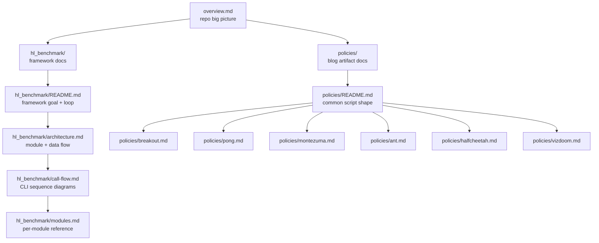

# `docs/` — Repository Documentation

These docs explain what lives in this repo and how the pieces fit together.
They are aimed at readers who cloned the artifact repo and want to
understand:

1. What the two code bases do and how they relate.
2. How data and control flow through the framework (`heuristic_learning/`).
3. How each blog policy is put together and where the numerical results in
   the blog come from.

The article itself is next to this folder as `learning-beyond-gradient.md`
(Chinese) and `learning-beyond-gradient.en.md` (English). These docs do not
replace the article; they document the code.

## How To Read

Start with the overview, then dive into whichever code base you care about.

## Index

### Top-level

- [`overview.md`](overview.md) — Repo layout, the two-layer mental model
  (blog artifacts vs. `hl_benchmark` framework), cross-cutting audit rules.

### `hl_benchmark/` framework (installable Python package)

- [`hl_benchmark/README.md`](hl_benchmark/README.md) — Framework goal, the
  evaluate-ledger-report loop, `make` entry points.
- [`hl_benchmark/architecture.md`](hl_benchmark/architecture.md) — Module
  dependency graph, data-flow diagram, ledger row schema, non-determinism
  and auditability entry points.
- [`hl_benchmark/call-flow.md`](hl_benchmark/call-flow.md) — Sequence
  diagrams for `make eval-env`, `make search`, `make report`, and
  `make rl-baseline`.
- [`hl_benchmark/modules.md`](hl_benchmark/modules.md) — Per-module
  reference for `envs`, `policies/`, `evaluate`, `search`, `rl_baseline`,
  `ledger`, `report`, `deepdive_report`, `summarize`, and `tests/`.

### Blog artifact policies (standalone `heuristic_*.py` scripts)

- [`policies/README.md`](policies/README.md) — Common script shape and
  cross-policy overview.
- [`policies/breakout.md`](policies/breakout.md) — Atari Breakout,
  `387 -> 507 -> 839 -> 864` mechanism-by-mechanism.
- [`policies/pong.md`](policies/pong.md) — Atari Pong, perfect 21 with
  spin bias + auto-calibrated actions.
- [`policies/montezuma.md`](policies/montezuma.md) — Atari Montezuma FSM,
  three search variants, and the 86-macro `400`-point replay.
- [`policies/ant.md`](policies/ant.md) — MuJoCo Ant CPG + residual MPC.
- [`policies/halfcheetah.md`](policies/halfcheetah.md) — MuJoCo HalfCheetah
  Fourier gait + asymmetric PD + staged-tree MPC.
- [`policies/vizdoom.md`](policies/vizdoom.md) — VizDoom D1 medikit CV,
  D3 Battle closed-loop combat with cv2 masks.

## What These Docs Do Not Cover

- The blog post's argument itself (that is what
  `learning-beyond-gradient.en.md` and its Chinese version are for).
- Rendering / deployment of the HTML page (see `render_learning_beyond_gradient.py`
  and `.github/workflows/deploy-pages.yml`).
- Community forks such as HL-ImageNet (see the top-level `README.md`).
