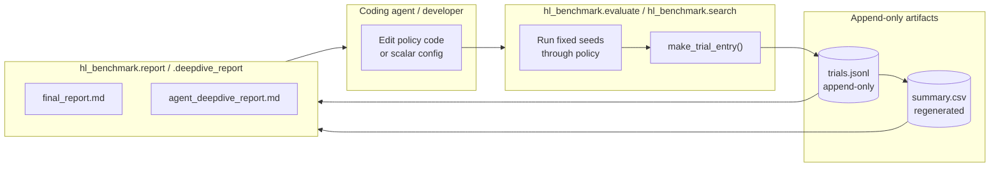

# `hl_benchmark` Framework

This is the "productionised" version of the Heuristic Learning idea. It is a
small installable Python package (`hl_benchmark`) that runs the same
`evaluate -> ledger -> report` loop the blog describes, but on five classic
control environments and with a fixed audit protocol.

## Goal

Answer one focused question:

> Can a coding agent maintain and improve a transparent heuristic control
> system across multiple environments, while preserving prior successes through
> tests and reporting costs and failures honestly?

To make the answer reproducible, the benchmark fixes:

- **Which environments** get compared: `CartPole-v1`, `MountainCar-v0`,
  `Acrobot-v1`, `LunarLander-v3`, `BipedalWalker-v3`.
- **Which seeds** get used: `dev = 0..19`, `holdout = 1000..1049`,
  `audit = 2000..2049`. `search.py` refuses to use holdout or audit seeds.
- **Which policy families** each environment ships: `random`, `initial`,
  `improved`, `tuned` (plus `tree` for Acrobot). See
  [`modules.md`](modules.md#policies) for the definition of each family.
- **What each trial writes**: one JSONL row appended to
  `results/trials.jsonl`, and a regenerated `results/summary.csv`.

## The Loop

Two rules keep the loop honest:

1. **Never delete rows.** If a change regresses, append a new row that says so.
2. **Scalar search stays on dev seeds.** `search.py` calls
   `ensure_search_split_allowed` and refuses holdout/audit splits so scalar
   tuning cannot leak into the reserved comparison sets.

## Entry Points

The `Makefile` (see `heuristic_learning/Makefile`) wraps the CLI modules:

| `make` target | Underlying module | Purpose |
| --- | --- | --- |
| `make test` | `pytest tests` | Run the unit-test suite. |
| `make eval-env ENV=X POLICY=Y SPLIT=Z` | `hl_benchmark.evaluate` | Evaluate one policy on one env. |
| `make eval-all SPLIT=Z` | `hl_benchmark.evaluate --all` | Evaluate all default policies on all envs. |
| `make search MAX_CANDIDATES=N` | `hl_benchmark.search --all` | Scalar/config search on dev seeds. |
| `make final-eval` | `hl_benchmark.evaluate --all --split holdout` | Frozen holdout evaluation. |
| `make report` | `hl_benchmark.report` | Regenerate `results/final_report.md`. |
| `make deepdive-report` | `hl_benchmark.deepdive_report` | Regenerate `results/agent_deepdive_report.md`. |
| `make rl-baseline ENV=X ALGO=A TRAIN_STEPS=N` | `hl_benchmark.rl_baseline` | Optional PPO/DQN/SAC comparator. |

## What Each Doc File Covers

- [`architecture.md`](architecture.md) — module dependency graph and the
  end-to-end data flow diagram (what data lives where, who writes it, who
  reads it).
- [`call-flow.md`](call-flow.md) — sequence diagrams for the three main CLI
  commands (`eval-env`, `search`, `report`) so you can see who calls whom.
- [`modules.md`](modules.md) — per-module reference: responsibilities, key
  functions, and their public interfaces.
