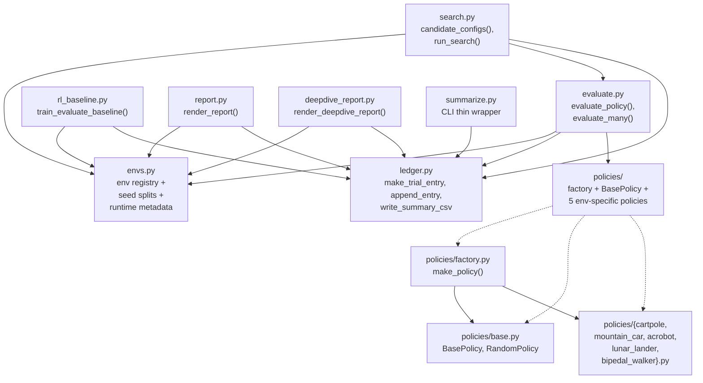
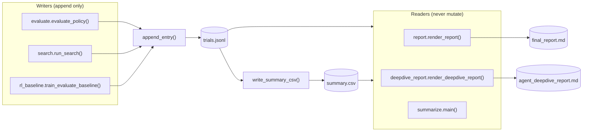

# Framework Architecture

This page shows how the `hl_benchmark` package is put together: which module
depends on which, and which data lives in which artifact.

## Module Dependency Graph

Each node is one Python module in `heuristic_learning/hl_benchmark/`. An arrow
`A --> B` means "A imports from B".

Legend:

- Solid arrows are Python imports.
- Dashed arrows show that `policies/__init__.py` re-exports the concrete
  classes and the `make_policy` factory.

Only `envs.py`, `ledger.py`, and `policies/` are used by more than one caller;
everything else (`evaluate`, `search`, `rl_baseline`, `report`,
`deepdive_report`, `summarize`) is a leaf that is invoked from the CLI.

## Data Flow

The framework has three artifacts under `heuristic_learning/results/`:

- `trials.jsonl` — append-only newline-delimited JSON, one row per trial.
- `summary.csv` — regenerated tabular view of `trials.jsonl`.
- `final_report.md` and `agent_deepdive_report.md` — Markdown reports built by
  reading `trials.jsonl` and `summary.csv`.

The write/read pattern is strictly:

Two invariants hold:

1. `trials.jsonl` is only ever opened in append mode by `append_entry` in
   `ledger.py:104`.
2. `summary.csv` is a pure derived view. Every writer that calls
   `append_entry` also calls `write_summary_csv` immediately after, and the
   reports call `write_summary_csv` before reading, so the CSV cannot drift
   from the JSONL.

## Ledger Row Schema

Every JSONL row carries the same required fields (validated by
`ledger.validate_entry`):

| Field | Type | Description |
| --- | --- | --- |
| `timestamp` | string | UTC ISO-8601, second precision |
| `environment` | string | Gymnasium `env_id` |
| `policy_version` | string | `random`, `initial`, `improved`, `tuned`, `tree`, or `rl-*` |
| `git_commit` | string | Short `git rev-parse HEAD`, or `"unavailable"` |
| `diff_identifier` | string | SHA256[:12] of the working diff, or `"clean"` / `"unavailable"` |
| `config` | object | Policy or algorithm config as a dict |
| `seed_range` | object | `{split, start, stop_exclusive, seeds[]}` |
| `episodes` | int | Number of episodes actually run |
| `score_stats` | object | `{mean, std, median, min, max}` (all `null` when no episodes ran) |
| `environment_steps` | int | Total `env.step` calls (plus `train_steps` for RL rows) |
| `wall_clock_seconds` | float | Rounded to 6 decimals |
| `tests_run` | array | Names of checks that passed for this row |
| `pass_fail` | string | `"pass"` or `"fail"` |
| `change_summary` | string | Human-readable description of the change |
| `failure_analysis` | string | Diagnosis text (or "No failure observed.") |
| `next_hypothesis` | string | What the author plans to try next |
| `change_type` | string | `structural policy improvement`, `scalar/config tuning`, `rl/deep learning baseline`, or `logging/diagnostics change` |
| `agent_iterations` | int | Coding-agent iterations spent on this row |
| `code_edits` | int | Code edits made for this row |
| `llm_cost` | object | Fixed `{calls, prompt_tokens, completion_tokens, total_tokens, source}` shape; values are `"unavailable"` unless a runtime plugs them in |
| `runtime_metadata` | object | Python version, platform, and package versions |
| `per_episode` | array | `[{seed, score, steps}, ...]` |
| `error` | string or null | Exception message on failure, `null` otherwise |

The point of the schema is that every row is self-describing: you can grep
`trials.jsonl` for `"pass_fail": "fail"` and immediately see the environment,
the config that failed, and the diagnosis. The reports never look at anything
outside these fields.

## Where Non-Determinism Lives

The framework tries to keep every non-deterministic surface listed in one
place, so that a bad seed cannot silently change a report:

- **Environment seeding** is passed through `env.reset(seed=seed)` and
  `env.action_space.seed(seed)` in `evaluate.evaluate_policy()` at
  `evaluate.py:83`.
- **Seed ranges** live in `envs.SEED_SPLITS` at `envs.py:12`. The framework
  never derives seeds elsewhere.
- **Search candidate seeds** come from the same `get_seeds()` helper via
  `evaluate_policy`, so `search.py` is guaranteed to use only the requested
  split.
- **RL training seed** is a separate `train_seed` argument in
  `rl_baseline.train_evaluate_baseline()`; the evaluation still uses the same
  fixed benchmark seeds.

## Where Auditability Comes From

Three code sites make the ledger auditable:

- `ledger.git_commit()` and `ledger.diff_identifier()` (`ledger.py:59`) attach
  the current commit and a hash of the working-tree diff to every row.
- `envs.discover_runtime_metadata()` (`envs.py:180`) records Python version,
  platform, and the installed versions of Gymnasium, Box2D, NumPy, and the
  Stable-Baselines3 stack. Missing packages appear as `not_installed` rather
  than being silently omitted.
- `ledger.llm_cost_from_env()` (`ledger.py:76`) always writes a fixed shape
  with explicit `"unavailable"` values, so a downstream reader can tell the
  difference between "not measured" and "zero".
