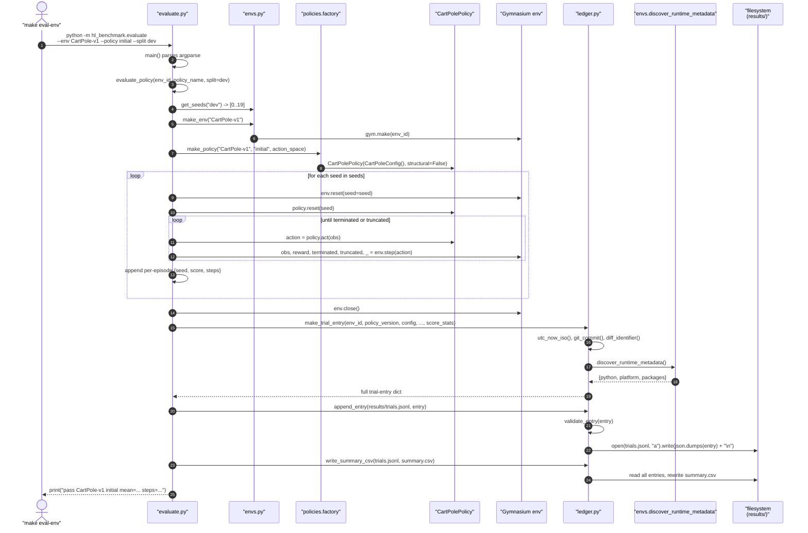
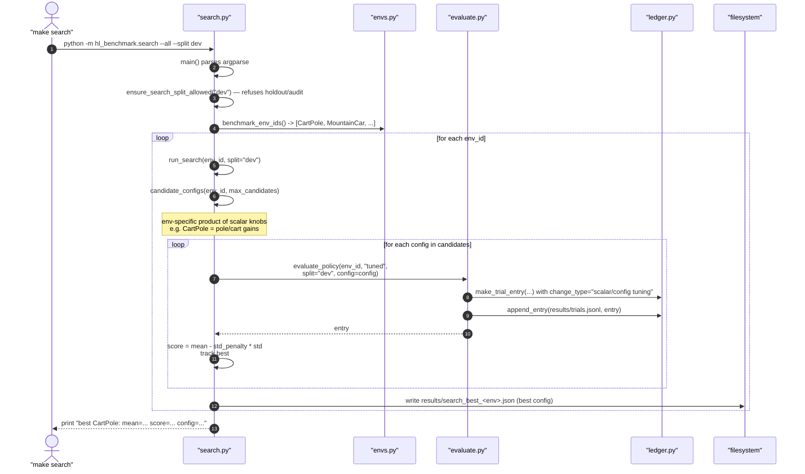
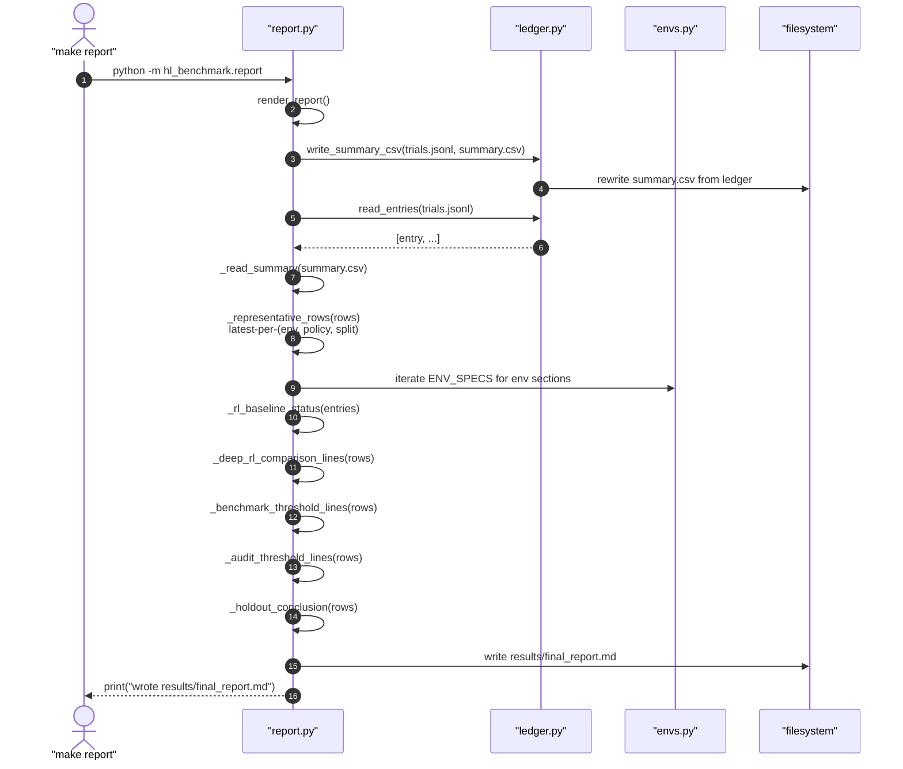
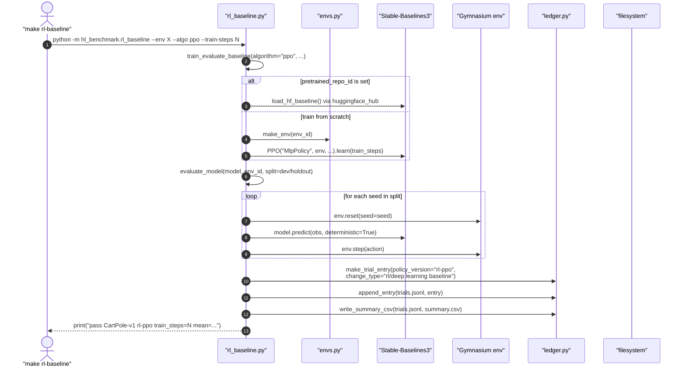

# Framework Call Flow

This page shows what actually happens when you run one CLI command. Each
diagram is a sequence trace through the module graph in
[`architecture.md`](architecture.md).

## `make eval-env ENV=CartPole-v1 POLICY=initial SPLIT=dev`

Evaluate one policy on one environment over one seed split, and append one
ledger row.

Key invariants visible in the trace:

- The env is instantiated exactly once and closed in a `finally` block
  (`evaluate.py:78-101`); a policy exception does not leak an env handle.
- Every row is validated by `validate_entry` before it hits disk. A missing
  required field raises `ValueError` and the row is not appended.
- `write_summary_csv` re-reads the entire JSONL, so the CSV always matches the
  ledger.

## `make search MAX_CANDIDATES=32`

Run scalar/config search on the dev split for every registered env, one after
the other. Each candidate becomes one ledger row.

Why `search.py` is separate from `evaluate.py`:

- `search.py:19` (`ensure_search_split_allowed`) hard-fails on holdout/audit.
  Structural evaluation runs freely on any split, but scalar tuning is
  segregated so it cannot silently overfit to reserved seeds.
- Every candidate goes through `evaluate.evaluate_policy` unchanged. Scalar
  search is "many small evaluations" rather than a separate code path.

## `make report`

Rebuild `results/final_report.md` from the append-only ledger.

The deep-dive report (`make deepdive-report`) follows the same shape but calls
`deepdive_report.render_deepdive_report()` instead, and adds per-env process
timelines and non-pass iteration tables.

## `make rl-baseline ENV=CartPole-v1 ALGO=ppo TRAIN_STEPS=10000`

Optional PPO/DQN/SAC comparator. This is an entirely separate CLI; it does not
modify the transparent-policy pipeline. Its ledger rows land in the same
`trials.jsonl` but with `policy_version="rl-ppo"` (or `rl-dqn` / `rl-sac` /
`rl-sac-hf`) and `change_type="rl/deep learning baseline"`.

Note: `environment_steps` in the RL row is `eval_steps + train_steps`, so the
cost of training is visible in the same column that the heuristic rows use for
env interaction.
