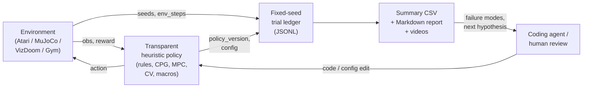

# Repository Overview

This document is the entry point for understanding what lives in this repo, how
the two code bases relate to each other, and where data flows across them.

## What This Repo Contains

The repo publishes the artifacts for the "Learning Beyond Gradients" (HL) blog
post. It ships two clearly separated code bases:

1. **Blog-artifact heuristic policies** (`atari/`, `mujoco/`, `vizdoom/`) —
   standalone Python scripts, one per game or task, that reproduce the numbers
   quoted in the article. Each script owns its own env loop, JSONL trial log,
   summary CSV, and (optionally) video recording. Nothing here trains a neural
   network.
2. **`heuristic_learning/` benchmark framework** — a small installable Python
   package (`hl_benchmark`) that reruns the Heuristic Learning discipline on
   five classic-control environments (CartPole, MountainCar, Acrobot,
   LunarLander, BipedalWalker) with a fixed seed protocol, an append-only trial
   ledger, a scalar-search baseline, and generated Markdown reports.

The two code bases share the underlying methodology (fixed seeds, transparent
policies, ledger-then-report) but not any imports. The blog artifacts are more
free-form (each game is a self-contained investigation); the framework is a
minimal, auditable benchmark that intentionally does not import the blog
scripts.

## Top-Level Repo Layout

```text
learning-beyond-gradients/
|-- learning-beyond-gradient.md       # Chinese blog source
|-- learning-beyond-gradient.en.md    # English blog source
|-- learning-beyond-gradient.html     # rendered bilingual page
|-- render_learning_beyond_gradient.py# HTML renderer
|-- README.md                         # repo README
|-- requirements.txt                  # renderer dependency (markdown)
|
|-- atari/                            # blog artifacts: Atari policies
|   |-- breakout/heuristic_breakout.py
|   |-- pong/heuristic_pong.py
|   |-- montezuma/*.py                # 5 files: policy + 3 searches + 400-replay
|   `-- atari57/atari57_prompt_template.txt
|
|-- mujoco/                           # blog artifacts: MuJoCo policies
|   |-- ant/heuristic_ant.py
|   |-- ant/heuristic_ant_min_policy.py
|   |-- ant/ant_envpool.xml
|   `-- halfcheetah/heuristic_halfcheetah_v5.py
|
|-- vizdoom/                          # blog artifacts: VizDoom policies
|   |-- heuristic_vizdoom_d1_cv.py    # D1 Basic: medikit CV
|   |-- heuristic_vizdoom_d3_cv.py    # D3 Battle: closed-loop combat
|   `-- record_vizdoom_d3_cv.py
|
|-- heuristic_learning/               # the benchmark framework
|   |-- hl_benchmark/                 # installable package
|   |   |-- envs.py                   # environment registry + seed splits
|   |   |-- policies/                 # per-env transparent policies
|   |   |-- evaluate.py               # fixed-seed evaluation harness
|   |   |-- search.py                 # scalar/config search baseline
|   |   |-- rl_baseline.py            # optional PPO/DQN/SAC comparator
|   |   |-- ledger.py                 # append-only trial ledger + CSV
|   |   |-- report.py                 # final Markdown report
|   |   |-- deepdive_report.py        # agent-process deep-dive report
|   |   `-- summarize.py              # CLI to regenerate summary.csv
|   |-- results/                      # generated ledger, summaries, reports
|   |-- tests/                        # pytest suite
|   |-- pyproject.toml
|   `-- Makefile                      # `make eval-env`, `make search`, ...
|
`-- docs/                             # (this folder) explains both code bases
```

## Two-Layer Mental Model

The blog message is that "coding agent + heuristic + ledger" replaces "neural
network + gradient update". Both code bases enact that message at different
scales:



The same shape appears in both code bases:

| Concern | Blog artifacts | `hl_benchmark` framework |
| --- | --- | --- |
| Environment | EnvPool Atari/VizDoom, Gymnasium MuJoCo | Gymnasium classic-control + Box2D |
| Policy source | Standalone `heuristic_*.py` scripts | `hl_benchmark/policies/*.py` |
| Where the ledger lives | Per-script `*_trials.jsonl` + `*_summary.csv` next to the script | Shared `heuristic_learning/results/trials.jsonl` + `summary.csv` |
| Report | Prose in the blog, MP4 renders | `results/final_report.md` and `results/agent_deepdive_report.md` |
| Update loop | Coding agent writes new code, appends new trial | Coding agent writes new code, appends new ledger entry |

## Cross-Cutting Rules

Both code bases follow the same audit rules the blog names in the appendix:

- **Fixed seeds first.** The framework fixes `dev = 0..19`, `holdout =
  1000..1049`, `audit = 2000..2049`. Blog scripts declare `--seed` on the
  command line and record it in every JSONL row.
- **Append-only history.** Nothing is deleted from `trials.jsonl` or per-script
  `*_trials.jsonl`. Failed trials get appended too, with a failure note.
- **No hidden state.** No policy trains weights; every policy is a Python
  function of the observation (plus an optional small recurrent state that is
  visible in the source).
- **Environment-step accounting.** Every trial row records `env_steps` or
  `cumulative_env_steps` so a sample-efficiency curve can be plotted after the
  fact.

## Where To Read Next

- To understand the framework: start with
  [`hl_benchmark/README.md`](hl_benchmark/README.md), then
  [`architecture.md`](hl_benchmark/architecture.md) for the module map and
  data flow, and [`call-flow.md`](hl_benchmark/call-flow.md) for how one CLI
  command traverses the modules.
- To understand any single blog policy: start with
  [`policies/README.md`](policies/README.md), then jump into a specific game:
  [Breakout](policies/breakout.md), [Ant](policies/ant.md),
  [HalfCheetah](policies/halfcheetah.md), [Montezuma](policies/montezuma.md),
  [VizDoom](policies/vizdoom.md), [Pong](policies/pong.md).
