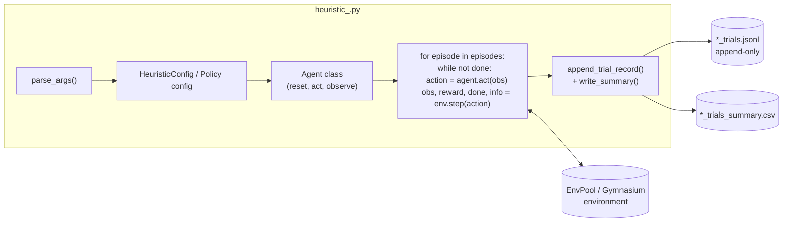

# Blog-Artifact Policies

This folder documents the standalone heuristic scripts under `atari/`,
`mujoco/`, and `vizdoom/`. Each script reproduces one number quoted in the
Learning Beyond Gradients blog post.

## The Common Shape

Every blog-artifact script is a self-contained Python file that owns the
whole loop. There is no shared framework import; the only shared assumptions
are:

- Use EnvPool (Atari, VizDoom) or Gymnasium (MuJoCo) directly.
- Do not train a neural network. Every action is produced by handwritten
  code — rules, PD controllers, CPG oscillators, MPC search, or CV pipelines.
- Append one JSONL trial record per invocation and rewrite a summary CSV
  with cumulative step counts (`atari/`, `mujoco/ant/`) or just print a
  reward vector (`atari/pong/`, `vizdoom/`).

The shape is close to the `hl_benchmark` framework, but simpler: no factory,
no seed-split registry, no shared ledger. Each script is optimised for
being read end-to-end.

## Anatomy Of A Blog-Artifact Script

Most scripts follow the same top-to-bottom order:

1. Copyright header + module docstring.
2. `SCRIPT_DIR`, default log/summary paths (so trial records land next to the
   script).
3. Enums for actions and small `@dataclass(frozen=True)` types for detections
   and recurrent state.
4. `@dataclass(frozen=True) HeuristicConfig` — every knob the CLI can tune.
5. Vision or RAM decoder classes/functions — return typed detection dataclasses.
6. Agent classes — take a detection, update recurrent state, return an action.
7. Free functions to `reset_env_with_info`, `step_env`, `append_trial_record`,
   `write_summary`, and `print_summary`.
8. `evaluate_heuristic_policy(args)` — the main entry that constructs env,
   config, agent, runs episodes, appends the trial row, prints the summary.
9. `parse_args()` and `if __name__ == "__main__": ...`.

Not every script follows every step (e.g. `vizdoom/` scripts skip the JSONL
trial log and go straight to printing rewards), but the ordering is the same.

## Per-Policy Landing Pages

| Env | Doc | Blog headline |
| --- | --- | --- |
| Atari Breakout | [breakout.md](breakout.md) | `387 -> 507 -> 839 -> 864` (RAM), 14.5K env steps to `864` (vision) |
| Atari Pong | [pong.md](pong.md) | `21.0` per episode with RAM ball/paddle decode |
| Atari Montezuma | [montezuma.md](montezuma.md) | `400` from an 86-macro open-loop replay |
| MuJoCo Ant | [ant.md](ant.md) | `~6146` with a CPG gait + residual MPC |
| MuJoCo HalfCheetah | [halfcheetah.md](halfcheetah.md) | `~11836` 5-seed mean with staged-tree MPC |
| VizDoom | [vizdoom.md](vizdoom.md) | D1 `mean=0.944`, D3 Battle `mean=557.0` from CV rules |

## Where The Real Complexity Lives

All the interesting heuristic engineering is in the agent classes:

- **Geometric prediction** — Breakout and Pong reflect the ball off side
  walls and target the interception point (`reflect_position` helpers).
- **State detection** — Breakout, VizDoom, and Pong extract ball, paddle,
  enemy, or medikit coordinates from either RAM byte offsets or `cv2` pixel
  masks with connected-component filtering.
- **Central pattern generators (CPG)** — Ant and HalfCheetah drive joint
  targets from a small Fourier oscillator over an internal phase variable,
  then a PD controller tracks the target.
- **Model-based short-horizon search** — Ant residual MPC and HalfCheetah
  staged-tree MPC copy the MuJoCo state at every step, sample candidate
  actions, roll each out for a few steps under the CPG baseline, and pick the
  best objective. Neither uses backprop.
- **Macro sequences** — Montezuma's 400-point run is 86
  `(action, duration)` pairs replayed open-loop, and the state-graph search
  scripts iterate over candidate macros to find them.
- **Closed-loop combat / navigation** — VizDoom D3 chooses among "engage
  enemy", "seek ammo/health", "escape wall", "novelty bounce" branches from a
  large `BASE_P` config dict, all driven by cv2 masks over the rendered
  screen and a handful of public game variables.

## What The Trial Log Rows Look Like

For the scripts that keep a JSONL log (`atari/breakout`, `atari/pong` results
are printed only, `atari/montezuma`, `mujoco/ant`, `mujoco/halfcheetah` search
log), each row records at least:

- `timestamp`, `trial_name`, `kind` (usually `"eval"`), `game`, `policy`.
- `seed`, `frame_skip`, `episodes_started`, `episodes_finished`.
- `env_steps`, `ale_frames` (for Atari), so cumulative sample-efficiency
  curves can be built.
- `score_mean`, `score_min`, `score_max`, `episode_scores`.
- `config` — the exact `HeuristicConfig` used, so a row is replayable.
- `notes` — free-form annotation the CLI accepts via `--notes`.

`write_summary(...)` then rewrites the matching `_trials_summary.csv` with a
running `cumulative_env_steps` column that the blog uses in its
sample-efficiency figures.
