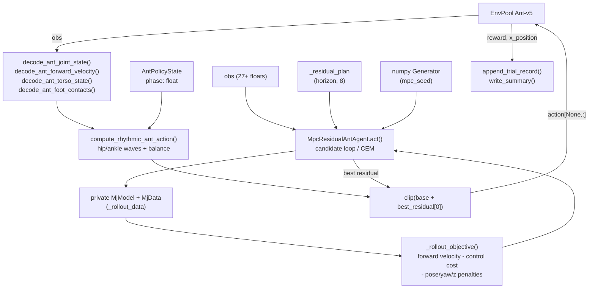

# MuJoCo Ant

**Files:**
- `mujoco/ant/heuristic_ant.py` (1160 lines) — full CLI, both policies, JSONL
  ledger, MPC.
- `mujoco/ant/heuristic_ant_min_policy.py` (339 lines) — minimal
  `AntMPCPolicy` class extracted from the CLI script, for embedding.
- `mujoco/ant/ant_envpool.xml` — the MuJoCo model used by the MPC rollouts.

**Blog result:** `mean~6146` on `Ant-v5` with the `--policy mpc` default.
Rhythmic-only reaches `~3162`; MPC residual pushes it to the `5000-6146`
range.

## What The Script Does

Play `Ant-v5` (EnvPool `Ant-v5`) with either:

- `--policy rhythmic` — pure CPG (Central Pattern Generator): a four-leg
  anti-phase joint-space oscillator with harmonic terms, tracked by a PD
  controller against the observed joint state. No model rollouts.
- `--policy mpc` — the same CPG as a base action, plus a short-horizon
  residual MPC. At every real env step, sample a batch of residual action
  sequences, roll each out in a private MuJoCo model, score, keep the best.
  Only the first residual is applied to the real env; the remaining residuals
  become a warm start for the next step.

Neither policy trains a network. The `mpc` policy owns its own
`mujoco.MjModel` and `MjData`, seeds a `numpy.random.Generator`, and does not
touch the real env's internal state — it copies the observation into the
private model before every rollout.

## Data Flow

## The Rhythmic Policy (CPG)

Every action starts from a phase variable `phase: float` (in radians).
`compute_rhythmic_ant_action()` at `heuristic_ant.py:178` maps that scalar to
a full 8-DoF action:

1. **Leg phases.** Each of 4 legs has a static offset in `ANT_LEG_PHASE =
   [0, pi, 0, pi]` (front-left / back-right vs. front-right / back-left).
2. **Warp for stance vs. swing.** `warp_ant_leg_phase()` stretches the
   stance half-cycle and compresses the swing half-cycle by
   `stance_duty`. `compute_adaptive_ant_stance_duty()` shifts this duty
   slightly with measured forward velocity.
3. **Hip and ankle waves.** Each joint's target is a first-plus-second-plus-
   third harmonic sinusoid (`hip_amp/h2/h3`, `ankle_amp/h2/h3`), scaled
   differently on the stance vs. swing half (`hip_stance_scale` /
   `hip_swing_scale`).
4. **Balance term.** Small pitch/roll and pitch-rate/roll-rate feedback
   couples torso attitude into the ankle targets.
5. **Heading.** Yaw and yaw-rate feedback biases the hip targets on the
   diagonal legs so the ant stays pointed forward.
6. **PD tracking.** `action = kp * (target - q) - kd * dq`, clipped to
   `[-1, 1]`.

The rhythmic policy alone gets around `3162` mean; every knob is exposed via
CLI so the blog's ablation table can be reproduced.

## The MPC Residual Policy

Given the CPG base action `a_base` at the current step, the MPC policy also
maintains a warm-started residual plan `_residual_plan[H, 8]` with
`H = mpc_horizon` (default `10`).

At every real env step:

1. Copy the current observation into the private MuJoCo model
   (`_set_mujoco_state_from_obs`).
2. Score the warm-started plan with `_rollout_objective`.
3. Sample `mpc_candidates - 1` (default `96 - 1`) perturbed residual plans:
   - Add `mpc_sigma` Gaussian noise, clip to `+/- mpc_clip`.
   - Smooth each sample over time: `residuals[1:] = 0.6*residuals[1:] +
     0.4*residuals[:-1]` (this is the "smooth residual noise" pattern; it
     stops the sampler from producing spiky action sequences).
   - If `mpc_num_knots > 1`, generate the noise as a linear interpolation of
     `num_knots` random knots instead — that gives smoother longer-horizon
     plans.
4. Score each; if `mpc_cem_iters > 0`, run CEM instead (`elite_frac` of top
   candidates form the next iteration's mean/std).
5. Advance the phase (`self._state.phase += compute_adaptive_ant_dphi(...)`).
6. Warm-start the next plan:
   `_residual_plan[:-1] = mpc_plan_decay * best_residuals[1:]` and zero the
   last slot.
7. Return `clip(a_base + best_residuals[0], -1, 1)`.

## Rollout Objective

`_rollout_objective` at `heuristic_ant.py:504` mirrors the shape of Ant-v5's
reward so the MPC can maximise something close to the real signal without
seeing it:

- `+ forward_weight * x_velocity` per step.
- `+ 1.0` if `0.2 <= z_position <= 1.0` (upright, alive), `- 50.0` otherwise.
- `- ctrl_cost * sum(action^2)`.
- `- pose_cost * (roll^2 + (pitch - pitch_target)^2)`.
- `- yaw_cost * yaw^2`.
- `- z_cost * (z - z_target)^2`.
- `- 100.0` if `z < 0.23` or `z > 0.95` (about to fall / jumping too high).
- After the horizon, `- terminal_vel_cost * ||qvel[6:14]||^2` to prefer plans
  that finish with low joint velocities.

Every coefficient is a CLI knob (`--mpc-pose-cost`, `--mpc-yaw-cost`,
`--mpc-z-target`, `--mpc-plan-decay`, ...). The default values in
`AntPolicyConfig` (`heuristic_ant.py:59-121`) are the ones that produce the
`6146` result.

## Observation Layout

Because Ant-v5's observation is a flat vector, all the decode helpers hard-
code offsets. The layout the script assumes (`heuristic_ant.py:592-644`):

| indices | meaning |
| --- | --- |
| `obs[0]` | z (torso height) |
| `obs[1:5]` | torso orientation quaternion (`w, x, y, z`) |
| `obs[5:13]` | 8 hinge joint positions |
| `obs[13:16]` | torso linear velocity (`vx, vy, vz`) |
| `obs[16:19]` | torso angular velocity (roll, pitch, yaw rates) |
| `obs[19:27]` | 8 hinge joint velocities |
| `obs[27:27+13*6]` | body external contact force tensor, flattened |

`ANT_Q_INDEX = [6, 7, 0, 1, 2, 3, 4, 5]` reorders the 8 hinge joints from
observation order into actuator order.

## The Minimal Policy File

`heuristic_ant_min_policy.py` is the same MPC policy stripped of the CLI, the
JSONL logger, and the CEM path. It exposes only `AntMPCPolicy` with `reset()`
and `act(obs)`, so it can be imported from another project (`from
heuristic_ant_min_policy import AntMPCPolicy`). Its constants are the same
ones that produce the `6146` mean.

## Trial Log Fields

Each run appends one row to `mujoco/ant/heuristic_ant_trials.jsonl` and
rewrites `heuristic_ant_trials_summary.csv`. The `params` sub-dict includes
every `--` knob (CPG + MPC), and the top-level row includes `score_mean/min/
max`, `x_position_mean/max`, and `cumulative_env_steps`, which is what the
blog's `heuristic_ant_sample_efficiency.png` plots.
