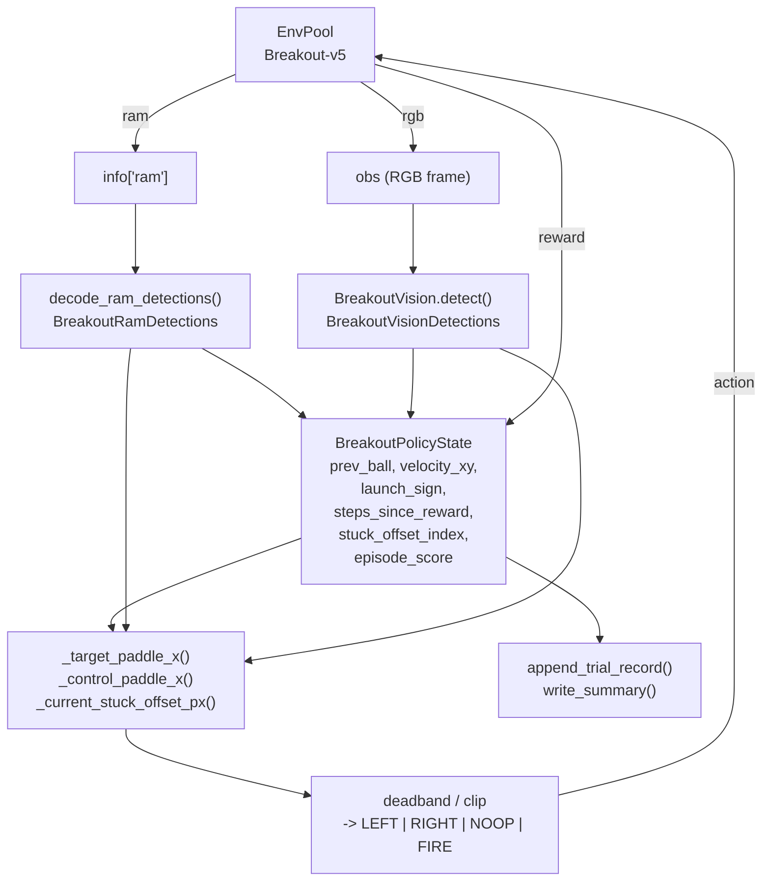

# Atari Breakout

**File:** `atari/breakout/heuristic_breakout.py` (1088 lines)
**Blog result:** RAM policy `387 -> 507 -> 839 -> 864` (theoretical max),
vision policy `864` at ~14.5K env steps.

## What The Script Does

Play `Breakout-v5` from EnvPool with a pure geometric heuristic. There are
two agents, both driven by the same `HeuristicConfig`:

- `RamBreakoutAgent` — decodes ball / paddle / brick occupancy from
  `info["ram"]` bytes.
- `VisionBreakoutAgent` — segments the same objects directly from RGB pixels
  using colour thresholds and connected components.

Both estimate ball velocity from consecutive detections, reflect the
trajectory against the two side walls, and move the paddle to the predicted
interception point. When there is no ball, they move to a launch position and
press FIRE.

## Data Flow



## The Core Geometry

Every action decision reduces to three questions:

1. Where is the ball right now, and where was it last frame?
2. Where will it be when it reaches the paddle y-line, after reflecting off
   the side walls?
3. Which direction should the paddle move to reach that x?

The main "geometry" is in `_target_paddle_x()` and `reflect_position()`:

```
if vy > 0.1 and ball_y <= paddle_y:
    # descending ball: predict interception, reflect off walls
    steps_to_paddle = (paddle_y - ball_y) / vy
    intercept_x = reflect_position(ball_x + vx * steps_to_paddle,
                                   lower=field_left,
                                   upper=field_right)
    target_x = intercept_x + launch_sign * tunnel_offset + stuck_offset(...)
elif vy >= fast_ball_min_vy:
    # fast low ball: use a short-lead heuristic instead of full interception
    target_x = ball_x + fast_low_ball_lead_steps * vx
else:
    # ascending / slow: chase with a small lead
    target_x = ball_x + chase_lead_steps * vx
```

## How The Blog's Score Ladder Maps To Code

The blog highlights four numerical milestones. Each one corresponds to a
specific mechanism that ships in the current code:

| Score | Mechanism | Config knob | Source location |
| --- | --- | --- | --- |
| `387` | Baseline interception only. No stuck-breaker, no fast-ball lead, no late-game guard. | `stuck_trigger_steps` = large, `fast_ball_min_vy` = large, `brick_balance_bias_min_score` = large | dataclass defaults in `HeuristicConfig`, `heuristic_breakout.py:92-117` |
| `507` | Stuck-breaker: after `stuck_trigger_steps` without reward, cycle a `+/- offset` on the intercept x to break the loop. | `stuck_trigger_steps=1024`, `stuck_switch_steps=256`, `stuck_offset_px=12.0` | `_current_stuck_offset_px()` at `heuristic_breakout.py:396-441` |
| `839` | Fast low-ball lead: when `vy >= fast_ball_min_vy` and the ball is already below the paddle-y, use a shorter constant lead instead of the reflection-based intercept. | `fast_ball_min_vy=3.0`, `fast_low_ball_lead_steps=3.0` | second `elif` in `_target_paddle_x()` at `heuristic_breakout.py:350-353` |
| `864` | Late-game care: once score >= 432 (through the first brick wall), taper the stuck offset as the ball approaches (`stuck_release_horizon_steps`), bias the offset toward the heavier brick side (`brick_balance_bias_min_score`), and lag the reported paddle x by 2 pixels to compensate for the one-step action delay (`late_game_paddle_lag_px`). | `stuck_release_horizon_steps=8`, `brick_balance_bias_min_score=432`, `brick_balance_deadzone=0.01`, `late_game_paddle_lag_px=2`, `late_game_lag_ball_y=170` | end of `_current_stuck_offset_px()` and `_control_paddle_x()` at `heuristic_breakout.py:422-441, 597-623` |

The blog's reproduction commands in Appendix A.2 pin these knobs
explicitly — that is what makes each intermediate score reproducible.

## Life Reset And Launch Sign

The RAM agent also handles life changes explicitly (`_handle_life_change` at
`heuristic_breakout.py:502-511`):

- Clear `prev_ball_xy` and `velocity_xy` (the launched ball is not the same
  physical ball).
- Flip `launch_sign` (`+1 <-> -1`) so the next launch aims to the other side
  of the field, which encourages tunneling.
- Reset `steps_since_reward` and `stuck_offset_index`.

The vision agent does not have `lives` in its observation, so it cannot mirror
this reset; instead it uses `missing_ball_frames > max_missing_ball_frames`
(default `8`) to conservatively drop velocity estimates.

## Trial Log Fields

Every invocation appends one row to
`atari/breakout/heuristic_breakout_trials.jsonl` and rewrites
`heuristic_breakout_trials_summary.csv` with cumulative env/ALE-frame counts.
The `config` field mirrors the CLI knobs above, so any row is fully
reproducible with a single `--config` reconstruction.

`write_summary(...)` builds the CSV used by the sample-efficiency figure in
the blog's `heuristic_breakout_sample_efficiency.png`.
