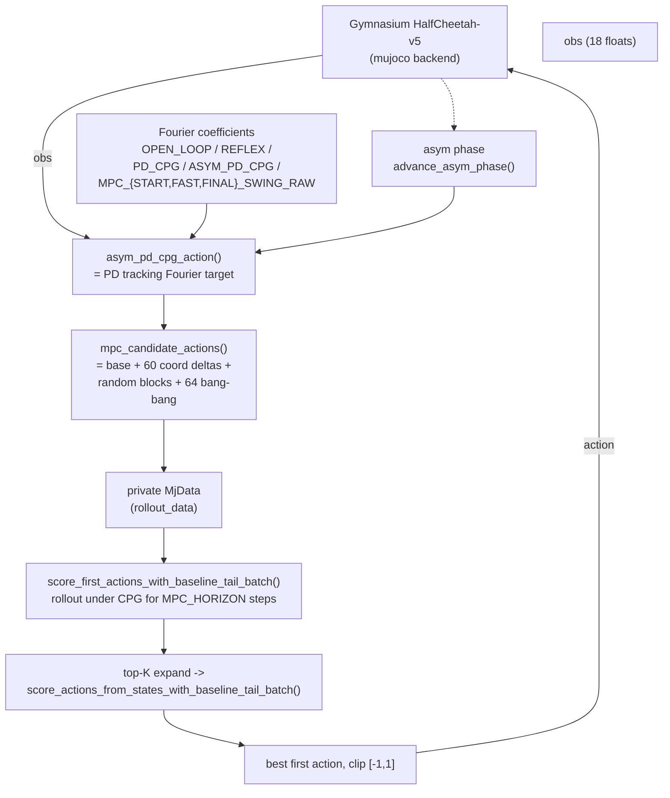

# MuJoCo HalfCheetah

**File:** `mujoco/halfcheetah/heuristic_halfcheetah_v5.py` (977 lines).
**Blog result:** 5-episode mean `11836.7` on `HalfCheetah-v5` with
`--policy mpc-staged-tree-asym-pd-cpg` and `--eval-seed 100`.

## What The Script Does

Play `HalfCheetah-v5` with a family of pure NumPy heuristics. Every policy
starts from the same building block — a Fourier target-angle gait `theta(t)`
in joint space — and then adds increasingly rich control on top:

| Policy name | Idea |
| --- | --- |
| `open-loop` | 31 CEM-tuned Fourier coefficients drive raw joint torques directly. |
| `reflex` | Same 31 coefficients + 4 x 6 proprioceptive reflex gains (joint angle, joint velocity, pitch, pitch rate). |
| `pd-cpg` | Fourier coefficients define a *target joint angle*; a PD controller tracks it. |
| `asym-pd-cpg` | Same, but the phase advances at two different rates in the stance vs. swing halves. |
| `mpc-asym-pd-cpg` | `asym-pd-cpg` as a baseline tail; short-horizon action search picks the first action. |
| `mpc-tree-asym-pd-cpg` | `mpc-asym-pd-cpg` extended to a top-K tree of second-step candidates. |
| `mpc-staged-tree-asym-pd-cpg` | The best-scoring policy. Same tree MPC but switches Fourier coefficients at env-step milestones (`start_swing -> fast_swing -> final_swing`). |

Every "raw" coefficient vector is stored inline in the script
(`OPEN_LOOP_RAW`, `REFLEX_RAW`, `PD_CPG_RAW`, `ASYM_PD_CPG_RAW`, and the
staged MPC variants derived from `ASYM_PD_CPG_RAW`). Those constants come from
the CEM search embedded in the same script (`--search`).

## Data Flow



## Fourier Gait Building Block

Every policy uses the same feature vector at time `t`:

```
theta = 2*pi * freq * t * DT           # DT = 0.05
features = [1, sin(theta), cos(theta), sin(2*theta), cos(2*theta)]
target = features @ coeff              # coeff is (5, 6)
```

`decode_gait(raw)` (`heuristic_halfcheetah_v5.py:305`) turns the raw vector
into `(freq, coeff)`:

- `freq = 0.5 + 4.5 * sigmoid(raw[0])` — always in `[0.5, 5.0]` Hz.
- `coeff = 0.9 * tanh(raw[1:31].reshape(5, 6))` — always in `(-0.9, 0.9)`.

The bounded shape means the CEM search never has to worry about degenerate
policies with runaway frequencies or unbounded torques.

## Asymmetric Phase

`advance_asym_phase(raw32, phase)` (`heuristic_halfcheetah_v5.py:374`)
advances a single phase variable with different frequencies in the two half-
cycles (`stance_freq`, `swing_freq`). It sub-steps
`ASYM_PHASE_MICROSTEPS = 10` times per env step so the switch between
frequencies stays smooth. This is the difference between `pd-cpg` and
`asym-pd-cpg`.

## The MPC Tree

`mpc_tree_asym_pd_cpg_action()` (`heuristic_halfcheetah_v5.py:611`) does two
tiers of candidate expansion:

1. **First-action candidates** (`mpc_candidate_actions(base_action, ...,
   include_random=True)`):
   - `base_action` from the asym-PD CPG.
   - `+/- MPC_COORDINATE_DELTAS` on each of the 6 actuators (60 candidates).
   - Three random blocks of Gaussian perturbations with different `std`
     values: `(0.15, 64), (0.35, 128), (0.70, 192)`.
   - `MPC_BANG_BANG_ACTIONS`: the 64-vector product of `{-1, +1}^6` — every
     bang-bang combination.
   Each candidate is rolled out for `MPC_HORIZON = 14` env steps under the
   asym-PD tail, scored by summed reward plus a terminal `qvel[0]` bonus.
2. **Second-action tree.** Keep the `MPC_TREE_TOP_K = 8` best first actions,
   then expand *deterministic* second-action candidates around each branch
   (`include_random=False`), roll out again, and take the argmax across all
   branches. Only the first action ever hits the real env.

The trick that makes this feasible in Python is `mujoco.rollout.rollout(...)`,
which batches many copied model states in a single C call.

## Staged Swing Schedule

`mpc-staged-tree-asym-pd-cpg` swaps the CPG coefficient vector at fixed
timesteps (`MPC_FAST_SWING_SWITCH_STEP = 300`, `MPC_FINAL_SWING_SWITCH_STEP =
900`):

- `t < 300` uses `MPC_START_SWING_RAW` (a small amplitude bias to establish
  a stable gait).
- `300 <= t < 900` switches to `MPC_FAST_SWING_RAW` (amplitude x 1.18, more
  forward bias on the front lower leg) to reach cruise speed.
- `t >= 900` returns to `MPC_START_SWING_RAW` (=`MPC_FINAL_SWING_RAW`) so the
  ending frames are conservative.

Each staged raw vector is built by `scaled_mpc_cruise_raw(amplitude_scale,
front_lower_leg_bias)` (`heuristic_halfcheetah_v5.py:243`). That is what
lifts the eval mean from `~5000` (single-coefficient MPC) to `~11836`.

## CEM Search

`--search` (`heuristic_halfcheetah_v5.py:836`) runs a Cross-Entropy Method
loop against `evaluate_raw_candidates()`, which batches `candidates x repeats`
copies of the env with `gym.make_vec(..., vectorization_mode="sync")`. The
selection score is `mean - 0.20 * std` (from `evaluate_raw_candidates`), so
CEM prefers stable candidates over ones that happened to score high on one
seed.

Every search iteration appends a `SearchIteration` record to
`heuristic_halfcheetah_v5_search.jsonl` with:

- `iteration`, `sampled_frames/episodes_this_iter/total`,
- `batch_best_score` and `batch_best_mean_return`,
- current running `best_score` and its `best_returns`,
- `search_action` string describing the CEM step (elite fraction, timing).

The MPC overlays (`mpc-*`) cannot be searched with `--search`; the script
raises a `ValueError` immediately if you try, on the reasoning that MPC is a
runtime overlay on top of an already-searched `asym-pd-cpg`.

## Trial Log Fields

Unlike the Atari scripts, HalfCheetah does not maintain a permanent JSONL
ledger for eval runs; it only writes the search log. Eval reruns just print a
JSON blob with `episodes`, `frames`, `mean_return`, `min/max_return`, and the
per-episode `returns` list. The blog table quotes `mean_return` from that
JSON.
