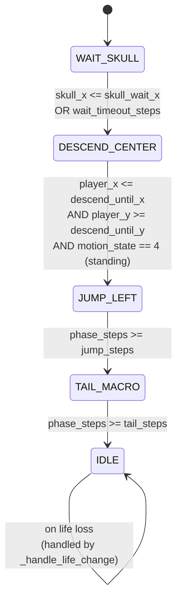
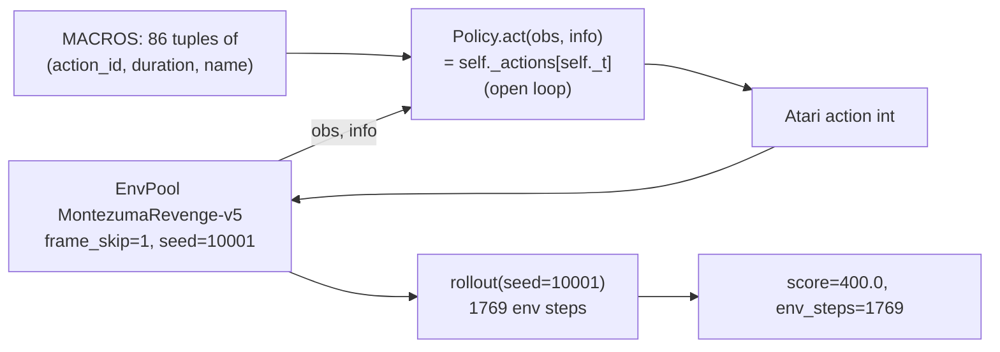

# Atari Montezuma's Revenge

**Files (all under `atari/montezuma/`):**

| File | Lines | Role |
| --- | --- | --- |
| `heuristic_montezuma.py` | 685 | First-room finite-state controller and left-jump grid search. |
| `heuristic_montezuma_state_graph_search.py` | 708 | Depth-limited BFS over stable-RAM states, using replay-from-reset. |
| `heuristic_montezuma_ale_state_search.py` | 647 | Same idea but with ALE clone-state snapshots instead of full replays. |
| `heuristic_montezuma_archive_search.py` | 720 | Beam / archive search over short macro sequences. |
| `heuristic_montezuma_400_policy.py` | 603 | Open-loop replay of the 400-point route (86 macros). |

**Blog result:** the `400_policy` replay hits `score=400`, `env_steps=1769`
with `seed=10001`. Everything else is either exploratory scaffolding or a
state-graph search that measures how close the agent can get to the key.

## The Common Shape

All five scripts share:

- `MontezumaAction` — the 18-value discrete Atari action enum.
- Some form of RAM decoding, at minimum `player_x`, `player_y`, `motion_state`,
  `skull_x`, `room_id`, `lives` (see `MontezumaRamState` in
  `heuristic_montezuma.py:81`).
- One JSONL trial log + one summary CSV per script, next to the source file.
- No neural network, no observation reads outside of `info["ram"]` or the
  ALE clone state.

The distinguishing feature is *how* the search over macros is organised:
grid, BFS from reset, clone-state expansion, or beam. All of them explicitly
budget `env_steps` so the search cost is visible.

## Script 1: `heuristic_montezuma.py` (First-Room FSM)

Runs one hand-written first-room agent, or scans one grid of its macro
constants.

Finite-state controller (`FirstRoomLeftJumpAgent` at
`heuristic_montezuma.py:118`) with five phases:

Each phase emits one Atari action per env step:

- `WAIT_SKULL` — NOOP until skull is on the safe side of the platform.
- `DESCEND_CENTER` — DOWN until player is on the low middle platform.
- `JUMP_LEFT` — `LEFTFIRE` (the standard jump-and-left combo) for
  `jump_steps` frames.
- `TAIL_MACRO` — a configurable follow-up action (default NOOP) for
  `tail_steps` frames.
- `IDLE` — hold `idle_action`.

Life loss immediately flips to `IDLE`, so the agent does not blindly continue
a macro after losing the last stable state.

`run_grid_search()` (`heuristic_montezuma.py:537`) iterates over the outer
product of `--grid-skull-wait-x`, `--grid-descend-until-x`,
`--grid-jump-steps`, `--grid-tail-action`, `--grid-tail-steps` and calls
`run_one_trial` per candidate. Every trial appends a JSONL row.

## Script 2: `heuristic_montezuma_state_graph_search.py`

Node = replayable macro sequence from reset (a `Candidate`); after replaying,
run a short NOOP tail to let the RAM settle; hash the settled state to
deduplicate. Expand at every depth by appending one primitive macro to every
frontier node.

- The graph is grown breadth-first; a bucketed frontier cap keeps memory
  bounded.
- Each depth appends one JSONL row summarising sampled env steps, new state
  count, and best distance to the key.

## Script 3: `heuristic_montezuma_ale_state_search.py`

Same graph shape, but each node stores an *ALE clone-state snapshot*
(`ALEInterface.encodeState()`), so expanding one node = restore snapshot,
apply one Atari action, and read the new state. This is much cheaper than
replaying the whole prefix at every depth.

The tradeoff is that the file requires `ale_py` and RAM bytes decoded from
the ALE snapshot rather than from `info["ram"]` — see the top-of-file
docstring at `heuristic_montezuma_ale_state_search.py:15`.

## Script 4: `heuristic_montezuma_archive_search.py`

Beam / archive search over `(action_id, frame_count)` macros. Ranking key:

1. Actual game score.
2. Room reached (novelty).
3. Minimum distance to the first-room key area over the trajectory.

Each depth appends one JSONL row and rewrites the CSV, so the sample-
efficiency curve for archive search is directly plottable.

## Script 5: `heuristic_montezuma_400_policy.py` (The 400-Point Replay)

The most self-contained one, and the one the blog appendix links to.

Key properties:

- **Open loop.** `Policy.act(obs, info)` ignores `obs` and `info` entirely
  and just returns `self._actions[self._t]`. If `_t` runs past the end of the
  scripted actions, it returns `fallback_action=0` (NOOP).
- **86 macros.** `MACROS` is a hard-coded list of `[action_id, duration,
  name]` triples. `Policy.__init__` expands them into a flat `_actions` list
  (`sum(durations) == 1769`) so `act()` is a constant-time lookup.
- **Fixed seed.** The route is only known to hit `400` at
  `seed=10001`; other seeds are not claimed.
- **Video / frame recording.** `--record-mp4` and `--frame0-png` produce the
  MP4 the blog embeds; both use `env.render()` with `render_mode="rgb_array"`
  and OpenCV writers.

The docstring at the top of the file names the source of the route:
"repaired 400-point native-image route found in thread
019d4cc1-9e30-78d0-b304-43b07c2aebe0". It is one deterministic path from a
much bigger search, replayed here for reproducibility.

## RAM Byte Map

Only used by the FSM controller and the search scripts — the 400 replay
does not need it. `decode_ram_state` at `heuristic_montezuma.py:186`:

| RAM offset | meaning |
| --- | --- |
| `ram[42]` | player x pixel |
| `ram[43]` | raw player y (`(312 - ram[43]) & 255` gives screen y) |
| `ram[2]` | motion state (`4` = standing on ground) |
| `ram[47]` | skull x pixel |
| `ram[3]` | room id |
| `info["lives"]` | lives remaining |

## Why Montezuma Has A Full Family Of Files

The blog frames Montezuma as the "boundary case" for HL: normal reactive
if/else policies cannot express the very long open-loop route to the key.
Each of the five files is a different attempt at that boundary:

- The FSM version answers "can a first-room-only policy get to the first
  reward?" (no, without richer state or macros).
- The three search files ask "if we frame macro composition as graph search
  over stable states, how far does the frontier get?" (in the blog: from
  key-distance `72` to `28`, still `0` reward).
- The 400 file exists to prove that *if* the search finds a working route,
  the resulting policy is trivially small (86 macros, `~1800` env steps)
  and completely deterministic. It sets a lower bound for how much
  complexity an HL policy needs when the environment has this shape.
