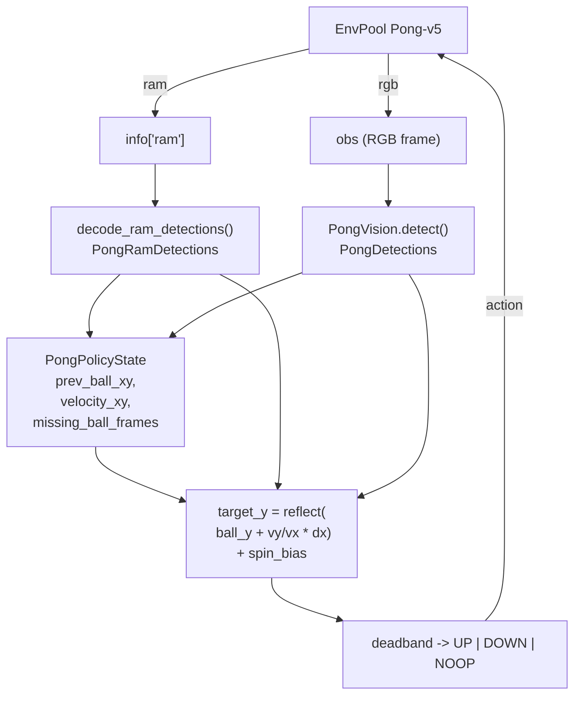

# Atari Pong

**File:** `atari/pong/heuristic_pong.py` (794 lines).
**Blog result:** `episode=0 score=21.0` and `mean=21.000` — a perfect episode
using the RAM policy (the default `--policy ram`).

## What The Script Does

Play `Pong-v5` from EnvPool with a pure geometric heuristic. Like Breakout,
it has two agents driven by the same `HeuristicConfig`:

- `RamPongAgent` — decodes ball and paddle Y coordinates from
  `info["ram"]` bytes (49, 50, 51, 54) using two hard-coded linear
  transforms.
- `HeuristicPongAgent` — segments ball and paddles directly from the RGB
  frame using luminance thresholds and connected components.

Both estimate ball velocity from consecutive detections, reflect the
trajectory against the top/bottom walls, and move the right paddle to the
predicted interception point.

## Data Flow



## Two Insight Moments

### 1. Spin bias — steer the outgoing ball away from the opponent

`_apply_spin_bias` (`heuristic_pong.py:361`) is the trick that pushes scores
from "just returning shots" to "reliably scoring 21":

```python
desired_outgoing_sign = 1.0 if opponent_paddle_y < home_y else -1.0
return intercept_y - desired_outgoing_sign * spin_offset_px
```

If the opponent is sitting above center, aim to hit the ball on the top
half of our paddle, which spins the return *down*. And vice versa. This uses
Pong's paddle-position-based deflection to place the ball where the opponent
is not.

### 2. Auto-calibration of the vision action ids

`calibrate_action_map` (`heuristic_pong.py:612`) is a small probe pass at the
start of a vision-mode run. It resets the env, tries each discrete action
for a few frames, measures paddle displacement per action, and labels
`(up, down, noop)` by argmin/argmax of the measured `delta_y`. If the deltas
are too small (the vision detector never latched on to the paddle), it falls
back to hardcoded ids from `config.fallback_*_action`.

This lets the same file work across ROM variants that ship a different
minimal action space — the "figure out what the actions mean by trying them"
pattern the blog names as one of the reusable heuristics.

## RAM Byte Map

`decode_ram_detections` at `heuristic_pong.py:572`:

| RAM offset | meaning |
| --- | --- |
| `ram[49]` | ball x pixel (raw); `ball_x = ram[49] - 49.0` |
| `ram[54]` | ball y pixel (raw); `ball_y = ram[54] - 13.0`; `0` means no ball in play |
| `ram[50]` | opponent paddle y (linear fit `0.981619 * ram[50] - 5.492890`) |
| `ram[51]` | self paddle y (linear fit `0.972157 * ram[51] - 2.553996`) |

The linear coefficients look magic but they are just least-squares fits
between RAM bytes and pixel positions the vision decoder produced during a
calibration episode. See the top-of-file docstring for the sourcing note.

## Velocity Smoothing

`_update_ball_state` (both `HeuristicPongAgent` and `RamPongAgent`) does an
exponential smoothing of ball velocity with `alpha = 0.5`:

```python
if abs(dx) <= max_velocity_jump_px and abs(dy) <= max_velocity_jump_px \
        and abs(dx) + abs(dy) > 0.25:
    if velocity_xy is None:
        velocity_xy = (dx, dy)
    else:
        old_dx, old_dy = velocity_xy
        velocity_xy = (0.5 * old_dx + 0.5 * dx, 0.5 * old_dy + 0.5 * dy)
else:
    velocity_xy = None
```

Two guards on top of the smoothing:

- `max_velocity_jump_px = 24.0`: any single-frame ball position jump larger
  than that is a re-launch or a detector glitch — drop the velocity estimate.
- The `> 0.25` guard filters out zero-velocity noise from repeated identical
  detections.

The vision agent also tracks `missing_ball_frames > max_missing_ball_frames`
(default `8`) to clear stale state when the detector loses the ball for too
long.
