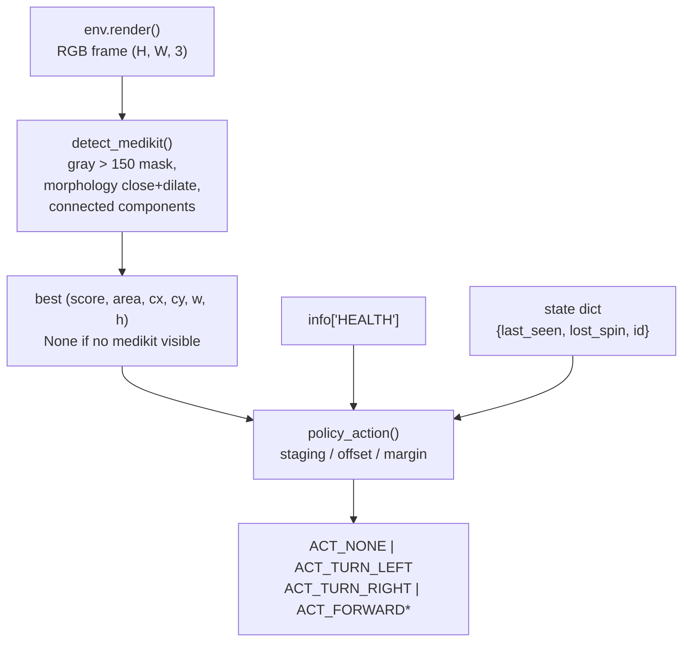
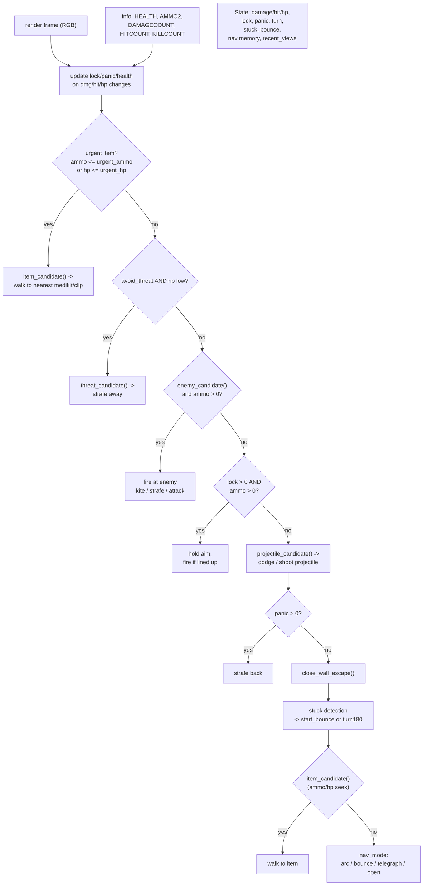

# VizDoom D1 Basic And D3 Battle

**Files:**
- `vizdoom/heuristic_vizdoom_d1_cv.py` (237 lines) — D1 Basic medikit policy.
- `vizdoom/heuristic_vizdoom_d3_cv.py` (1098 lines) — D3 Battle combat +
  navigation policy.
- `vizdoom/record_vizdoom_d3_cv.py` (128 lines) — 10-seed 35fps render grid
  MP4 recorder for D3.
- `vizdoom/README.md` — one-page quickstart.

**Blog result:**
- D1: 10-seed `mean=0.944`, `min=0.290`, single-episode reward ceiling `~1.01`.
- D3: 10-seed `mean=557.0`, `min=440.0`, rewards
  `[545, 475, 480, 440, 690, 500, 600, 595, 530, 715]`.

Neither policy trains a network. Both use only `cv2` and NumPy on the
rendered screen plus a small set of public game variables (`HEALTH`,
`AMMO2`, `HITCOUNT`, `DAMAGECOUNT`, `KILLCOUNT`).

## D1 Basic: `heuristic_vizdoom_d1_cv.py`

VizDoom D1 Basic is the "one medikit per episode" scenario. Reward is
`+1` for picking up the medikit; there is a small `-0.0001` per-step penalty
if you never pick it up.

The policy's whole loop is `detect_medikit -> policy_action`:



### Key insights the code embeds

- **Staging when HP is high.** The blog's key trick: `PICKUP_HEALTH = 68.0`
  and `STAGE_AREA = 180.0` in `heuristic_vizdoom_d1_cv.py:18-19`. When the
  medikit is close (large area / high bounding box / high row) *and* health
  is still above `PICKUP_HEALTH`, the policy centers on the medikit but does
  not walk into it. It waits for the per-step penalty to drop health, then
  picks up the medikit for maximum reward.

  ```python
  if close and health > PICKUP_HEALTH:
      if offset < -16: return ACT_TURN_LEFT
      if offset > 16:  return ACT_TURN_RIGHT
      return ACT_NONE            # stand next to it, don't step onto it
  ```

- **Lost-medikit search.** When the medikit is not visible for a while, the
  policy alternates turn directions (`state["last_seen"]`, `state["lost_spin"]`)
  based on where the medikit last appeared, so it keeps sweeping the same
  arc rather than spinning in place.

- **Wide-mask reject.** `detect_medikit()` filters out any component with
  `w > width * 0.40 and h < height * 0.05` — those are usually distant walls,
  not medikits. Only tight, tall-ish blobs remain.

### Recorder

The same file records 35fps 10-seed render grids via
`--record-mp4 vizdoom/d1_cv_10seed_render_35fps.mp4`. `make_grid()` tiles the
per-env `env.render()` frames in a 2x5 layout and overlays reward + health
per env.

## D3 Battle: `heuristic_vizdoom_d3_cv.py`

D3 Battle is much richer: multiple enemies, projectile damage, medikits,
ammo clips, a maze-like map, and a `HEALTH + AMMO + HITCOUNT + DAMAGECOUNT +
KILLCOUNT` reward mix. Reward is `1 * DAMAGECOUNT + 10 * KILLCOUNT`.

The policy is a `choose(obs, info, state, step, p)` function
(`heuristic_vizdoom_d3_cv.py:451`) that branches on a large `BASE_P` config
dict. Every branch is one closed-loop behavior:



### Structure of `BASE_P`

`BASE_P` (`heuristic_vizdoom_d3_cv.py:785`) is ~230 keys grouped by concern:

- **Combat.** `aim_k`, `shoot_tol`, `max_turn`, `close_area`, `close_h`,
  `strafe_mode`, `hit_lock`, `panic`, `kite`.
- **Item seeking.** `item_k`, `ammo_seek`, `hp_seek`, `urgent_*`.
- **Threat / projectile.** `avoid_threat`, `threat_*`, `projectile_*`,
  `proj_*`.
- **Navigation.** `arc_turn`, `bored_after`, `bored_turn`, `bored_forward`,
  `bored_scan_turn`, `bored_context_*`, `adapt_*`, `nav_*`, `open_*`.
- **Anti-stuck.** `stuck_diff`, `stuck_limit`, `stuck_random_bounce`,
  `turn180_stuck`, `bounce_*`, `telegraph_*`, `novelty_*`.
- **Wall / escape.** `wall_avoid`, `wall_bored`, `wall_back`, `wall_*`,
  `escape_*`.
- **CV thresholds.** `c0`, `margin`, `enemy_channel`, `enemy_*`, `body_*`,
  `item_*`, `clip_*`, `threat_*`, `proj_*`.

Each subgroup is what a single blog "coding-agent iteration" would touch.
Every key has a default that ships with the policy; the `run(p)` function
takes an overridable dict.

### CV pipelines (`enemy_candidate`, `item_candidate`, `threat_candidate`, `projectile_candidate`, `nav_candidate`, `wall_avoid_turn`, `close_wall_turn`)

All CV functions follow the same 5-step pattern:

1. Split the RGB frame into three `int16` channels.
2. Build a boolean mask from per-channel thresholds and cross-channel
   margins (`(c0 > threshold) & ((c0 - max(c1, c2)) > margin)`).
3. Blank the mask's top and bottom bands (sky / HUD).
4. Morphological close + dilate with a size proportional to `sx = w / 320`,
   `sy = h / 240`, so the same thresholds work at any resolution.
5. `cv2.connectedComponentsWithStats(...)`; score each component
   (area x aspect x center-distance x vertical bias), return the best.

The scoring keeps only "believable" targets — an enemy candidate with `bh <
7 * sy` is too small, one with `bw > 95 * sx` is too wide, and so on.

### State object

`State` at `heuristic_vizdoom_d3_cv.py:311` collects everything the policy
remembers across steps:

- **Combat state:** `damage`, `hit`, `health`, `lock`, `bad`, `dx`, `panic`.
- **Movement state:** `turn`, `prev` (previous frame), `stuck`, `bump`,
  `bounce`, `bounce_i`, `bounce_turn`.
- **Navigation state:** `arc_turn` / `bored_after` / `bored_turn` (adapted
  by `adapt_arc`), `nav_i`, `nav_until`, `nav_turn`, `close_area`,
  `close_h`, `wall_escape`, `wall_escape_turn`, `open_commit`, `open_turn`.
- **Novelty:** `recent_views` — a rolling list of hashed low-res frames used
  to detect that the agent has been in the same visual state before.

`last_progress` is the last step index where reward changed. Every "bored"
branch is gated on `step - last_progress > threshold`, so idle behaviors only
kick in when the agent hasn't scored recently.

### Adaptation

`adapt_arc` (`heuristic_vizdoom_d3_cv.py:688`) switches to different
`arc_turn` / `bored_after` / `bored_turn` values at a specific step, based on
progress:

- **High progress:** `hp >= adapt_fast_hp` and `dmg >= adapt_fast_damage`
  -> more aggressive `adapt_fast_*` constants.
- **Low progress or danger:** `dmg <= adapt_low_damage` and either high hp or
  dangerously low hp -> more conservative `adapt_*` constants, optionally
  flipping the turn direction.

`adapt_close` similarly switches `close_area` / `close_h` at another step,
so the "am I in melee range?" thresholds adapt to whether the current combat
loop is going well.

### D3 recorder

`record_vizdoom_d3_cv.py` runs the exact same `choose()` policy on 10 envs
and records a 35fps 5x2 grid MP4 with `imageio` + `libx264`. It imports the
D3 module dynamically (`importlib.util.spec_from_file_location`) so it does
not need the vizdoom folder to be a Python package.
