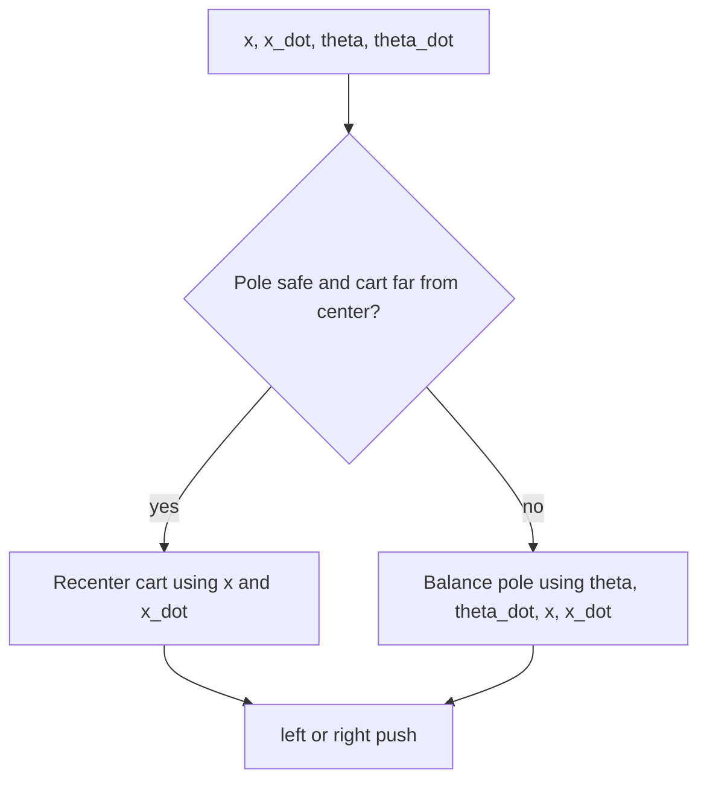
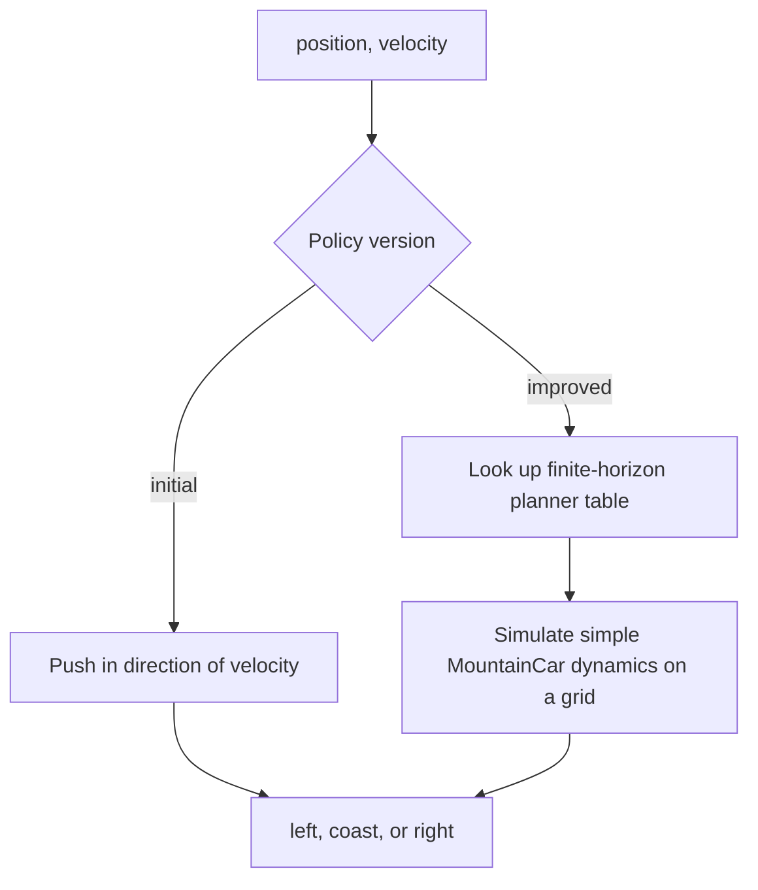
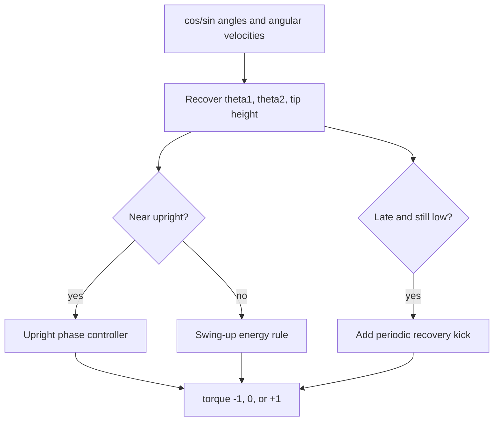
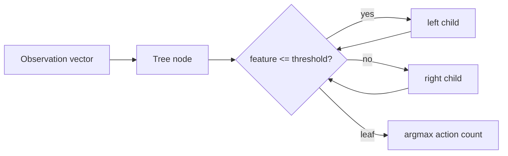
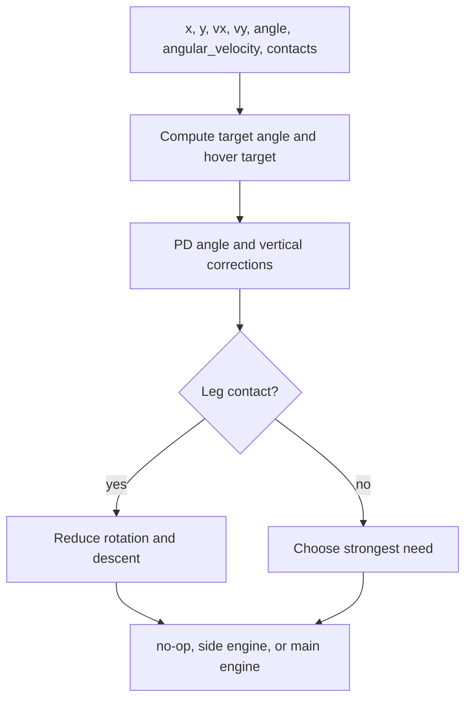
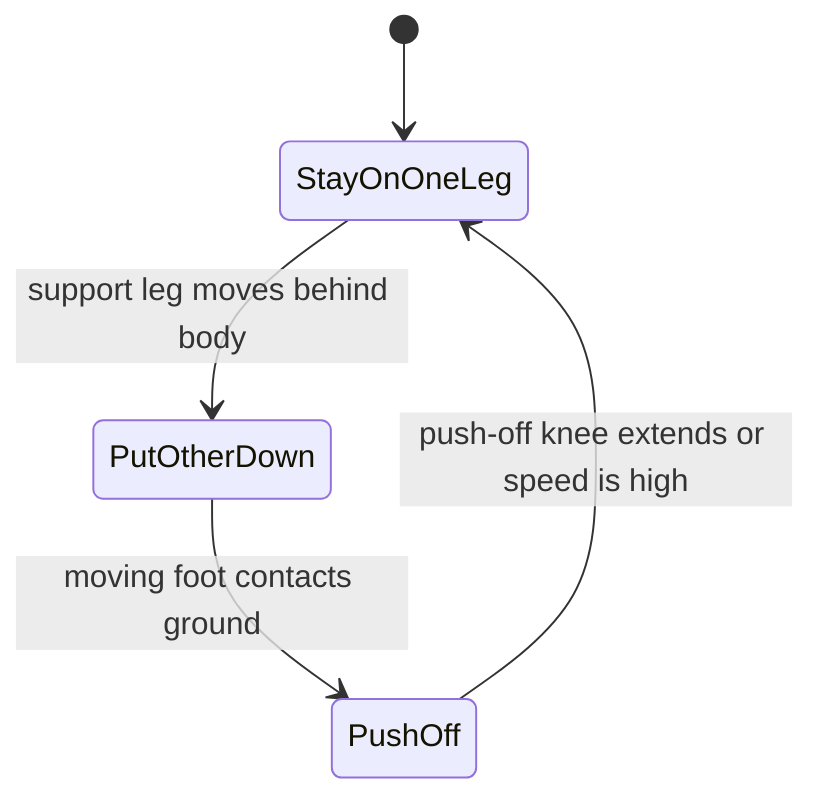
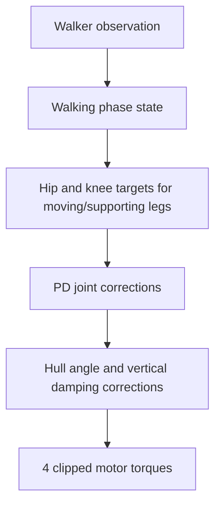
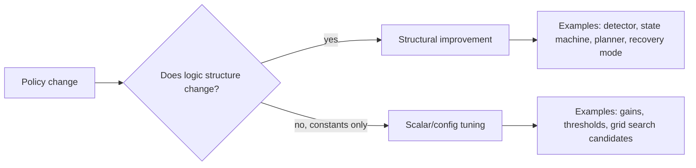

# Heuristic Policy Explainer

This report explains how the benchmark's transparent heuristic policies work at
a high level. It is an explanatory companion to `final_report.md`, not a new
evaluation run. Scores quoted here come from the existing ledger summary.

The main idea is simple: each policy reads the environment observation, computes
a few human-readable features, applies explicit rules or modes, and emits an
action. Improvements are represented as code/config/test edits, not neural
weight updates.

## Control Loop

The benchmark tests whether this loop can maintain a useful control system:
read failures, make a specific interpretable edit, preserve earlier successes,
and record the result.

## Where The Policies Live

| Environment | Policy file | Main policy shape |
| --- | --- | --- |
| CartPole-v1 | [`cartpole.py`](../hl_benchmark/policies/cartpole.py) | Weighted sign controller plus a recentering guard |
| MountainCar-v0 | [`mountain_car.py`](../hl_benchmark/policies/mountain_car.py) | Energy pumping, then a finite-horizon tabular planner |
| Acrobot-v1 | [`acrobot.py`](../hl_benchmark/policies/acrobot.py) | Swing-up rule, recovery mode, and a transparent decision tree |
| LunarLander-v3 | [`lunar_lander.py`](../hl_benchmark/policies/lunar_lander.py) | PD-style hover/angle controller with contact landing logic |
| BipedalWalker-v3 | [`bipedal_walker.py`](../hl_benchmark/policies/bipedal_walker.py) | Open-loop gait, then an explicit walking state machine |

The public factory is [`factory.py`](../hl_benchmark/policies/factory.py). It
keeps the old `make_policy(env_id, policy_name)` API while dispatching to the
individual environment modules.

## Score Snapshot

Holdout seeds are `1000..1049`. Higher score is better for every environment,
including the negative-score classic-control tasks.

| Environment | Initial heuristic | Structural heuristic | Scalar/search best | Best recorded RL comparator | What this says |
| --- | ---: | ---: | ---: | ---: | --- |
| CartPole-v1 | 500.00 | 500.00 | 500.00 | 500.00 | A simple sign controller already solves it. |
| MountainCar-v0 | -117.98 | -107.64 | -117.98 | -104.34 | The model-based structural planner helps and is close to DQN. |
| Acrobot-v1 | -141.60 | -87.74 tree | -119.72 | -84.68 | The transparent decision tree is close to PPO. |
| LunarLander-v3 | 199.13 | 148.79 | 274.88 | 276.88 | Scalar tuning beat the attempted structural edit. |
| BipedalWalker-v3 | -129.22 | 294.43 | -120.95 | 300.77 | The explicit gait state machine nearly matches the pretrained SAC comparator. |

Important caveat: the best LunarLander result is scalar/config tuning, not a
structural heuristic improvement. That distinction is intentional in the ledger.

## CartPole-v1

CartPole observes cart position, cart velocity, pole angle, and pole angular
velocity. The action is a left or right cart push.

Initial policy:

- Computes a weighted score from pole angle, pole angular velocity, cart
  position, and cart velocity.
- Pushes right if the score is positive, otherwise left.
- This is a transparent sign controller.

Structural improvement:

- Adds a recentering guard.
- If the pole is already nearly upright and not rotating much, but the cart is
  far from the track center, the policy temporarily prioritizes cart position.
- In the final ledger this did not improve the score because the initial policy
  already reached the episode cap on all holdout seeds.

High-level interpretation: CartPole is easy enough that the best heuristic is
almost just "push under the falling pole." The main maintenance concern is not
score improvement, but avoiding changes that break an already solved behavior.

## MountainCar-v0

MountainCar observes position and velocity. The action is push left, do nothing,
or push right. The car must build energy by rocking before it can reach the goal.

Initial policy:

- If velocity is positive, push right.
- If velocity is negative, push left.
- This pumps energy into the system but does not plan the final approach.

Structural improvement:

- Builds a deterministic grid planner from the known MountainCar dynamics.
- The planner works backward over a fixed horizon and stores the best action for
  each discretized `(position, velocity)` state.
- At runtime, the current state is rounded to the grid and the corresponding
  action is used.

High-level interpretation: this is still a heuristic system, but it is no longer
just a threshold rule. It is a tiny transparent model-based controller. The
important structural edit is adding a planner, not merely changing a gain.

## Acrobot-v1

Acrobot observes sine/cosine encodings of two joint angles plus two angular
velocities. The action is negative, zero, or positive torque at the actuated
joint. The goal is to swing the free end high enough.

Initial policy:

- Converts sine/cosine observations back into joint angles.
- Builds a command from joint velocities and the phase of the two-link arm.
- Applies positive or negative torque based on the command sign.

Structural improvements:

- Adds an upright detector so the policy changes behavior near the target
  region instead of using the same swing-up rule everywhere.
- Adds a late recovery kick if the system has spent many steps without reaching
  useful height.
- Adds a transparent decision-tree policy distilled from a recorded PPO
  comparator. The tree is explicit JSON with feature thresholds and leaf action
  counts, not a neural network.

Decision-tree path:

High-level interpretation: the handwritten swing-up rule is readable but
brittle. The tree policy is less hand-designed, but it remains auditable because
each decision is a feature threshold and the full artifact is checked in.

## LunarLander-v3

LunarLander observes position, velocity, angle, angular velocity, and two leg
contact flags. The action is no-op, left engine, main engine, or right engine.

Initial policy:

- Sets a target angle based on lateral position and lateral velocity.
- Computes an angle correction and a vertical hover correction.
- Fires the main engine if vertical correction dominates.
- Fires side engines if angular correction dominates.

Structural improvement attempted:

- Adds special landing behavior for one-leg and two-leg contact.
- Adds low-altitude softening when nearly centered.
- This did not beat the initial policy on holdout. The ledger keeps this result
  instead of hiding it.

Scalar/search result:

- Tuning controller gains produced the best transparent LunarLander score in the
  current benchmark.
- This is useful evidence, but it is labeled scalar/config tuning rather than
  structural policy improvement.

High-level interpretation: LunarLander is a case where transparent control is
viable, but the successful change was mostly gain selection. That weakens the
claim that every gain came from structural agent-maintained improvements.

## BipedalWalker-v3

BipedalWalker observes hull state, joint states, contacts, and lidar fractions.
The action is four continuous motor commands: left hip, left knee, right hip,
right knee.

Initial policy:

- Uses an open-loop sinusoidal gait.
- Alternates which leg swings based on a fixed period.
- Adds a small hull-angle correction.
- It does not truly know which foot is supporting the body.

Structural improvement:

- Replaces the open-loop gait with a contact-aware state machine.
- Tracks moving leg, supporting leg, and support knee angle.
- Uses state transitions:
  - `STAY_ON_ONE_LEG`: move one leg forward while the other supports.
  - `PUT_OTHER_DOWN`: lower the moving leg until contact.
  - `PUSH_OFF`: extend the old support leg to propel the hull forward.
- Converts hip/knee targets into motor commands with explicit PD gains.
- Adds hull stabilization and vertical damping.

High-level interpretation: this is the clearest example of the hypothesis. The
agent-maintained policy became a readable controller with phases, contacts, and
joint targets. It moved from a failing open-loop rhythm to near solved-score
locomotion without training neural weights.

## Structural vs Scalar Changes

Structural examples in this benchmark:

- CartPole recentering guard.
- MountainCar finite-horizon planner.
- Acrobot upright detector, recovery mode, and transparent tree.
- BipedalWalker contact-aware gait state machine.

Scalar/config examples:

- LunarLander controller gain search.
- BipedalWalker speed/scale sweeps.
- Acrobot gain sweeps.

The distinction matters because the hypothesis is not just "can constants be
tuned." It is "can an agent maintain and improve a readable control program."

## Reading The Results Honestly

What supports the hypothesis:

- The best transparent policies solve or nearly solve several fixed-seed
  benchmark targets.
- MountainCar, Acrobot, and BipedalWalker show meaningful structural policy
  changes.
- The policy code is readable and split by environment, which makes future
  maintenance easier.
- The ledger preserves rejected and partial attempts.

What weakens the hypothesis:

- CartPole was already solved by the initial heuristic, so it does not show much
  improvement pressure.
- LunarLander's best transparent result came from scalar tuning, not a
  structural policy edit.
- Some early "improved" variants made performance worse and had to be revised.
- The Acrobot tree is transparent at inference time, but it was distilled from a
  neural comparator, so it is not purely handwritten.

## Mental Model

The heuristic system is best understood as a small library of controllers:

- CartPole: balance first, recenter only when safe.
- MountainCar: use a known model to choose momentum-building actions.
- Acrobot: swing up, switch near upright, recover if stuck, optionally use an
  explicit decision tree.
- LunarLander: choose between hover and angle correction, with contact-aware
  landing guards.
- BipedalWalker: walk through named gait phases and convert target joint angles
  into motor torques.

That is the essence of "learning beyond gradients" in this experiment: the
policy improves by changing the program's structure, tests, and configuration,
while every meaningful trial is recorded for audit.
